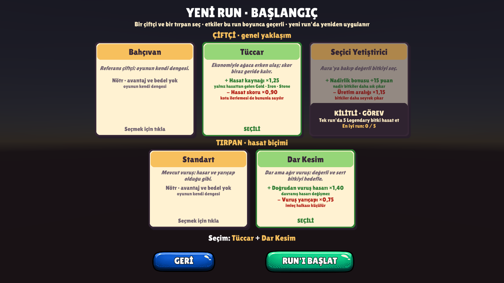
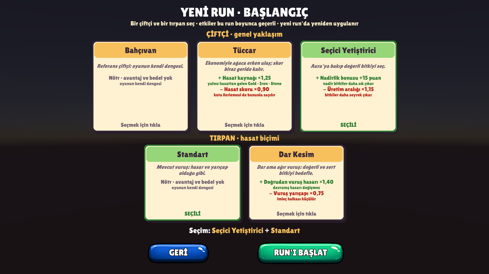
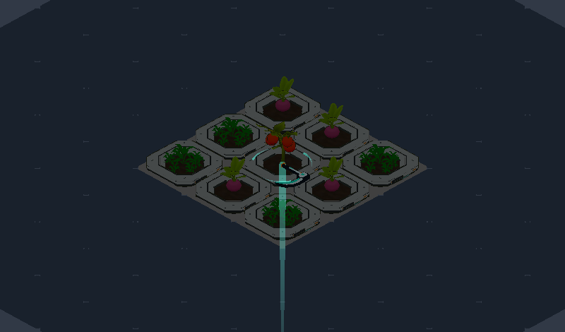
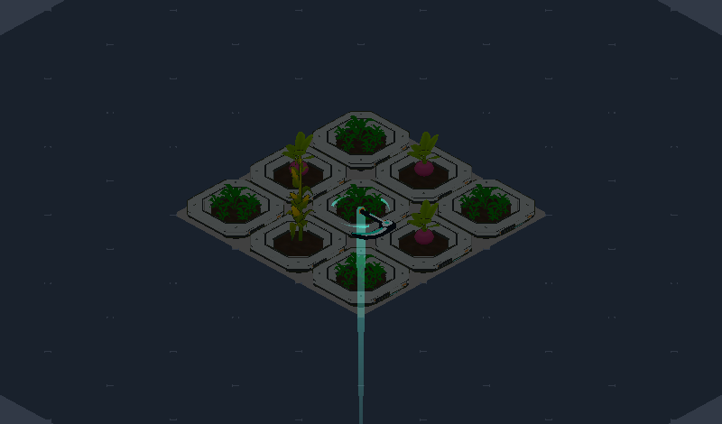

# Bölüm 3.3 — Başlangıç seçimi, çiftçi / tırpan ve görev altyapısı

1 Ekim 2026. Kaynak belgeler: [Bolum3-1-Run50-GucVeIcerikPlani.md](Bolum3-1-Run50-GucVeIcerikPlani.md), [Bolum3-2-Run50-ReferansOlcum.md](Bolum3-2-Run50-ReferansOlcum.md).

Bu paket genişletilebilir altyapıyı ve az sayıda çalışan örneği ekler. Skill tree, can, kota, round süresi, XP, elektrik, boss ve saksı türleri değişmedi. Değerler 3.1'deki ilk test değerleridir; dengelenmiş değildir.

## 1. Gerçekten çalışan içerikler

| İçerik | Tür | Durum | Etki (asset değeri) |
|---|---|---|---|
| Bahçıvan | Çiftçi | Başta açık | Nötr: etki yok |
| Tüccar | Çiftçi | Başta açık | Hasat kaynağı ×1,25 · hasat skoru ×0,90 |
| Seçici Yetiştirici | Çiftçi | Görevle açılır | Nadirlik bonusu +15 puan · üretim aralığı ×1,15 |
| Standart | Tırpan | Başta açık | Nötr: mevcut vuruş |
| Dar Kesim | Tırpan | Başta açık | Doğrudan vuruş hasarı ×1,40 · vuruş yarıçapı ×0,75 |
| "Tek run'da 5 Legendary bitki hasat et" | Görev | Çalışıyor | Seçici Yetiştirici'yi kalıcı olarak açar |

- Katalogda yalnız bunlar var. Kalan 5 çiftçi ve 2 tırpan (Geniş Orak dahil) eklenmedi ve ekranda gösterilmiyor.
- 6 kombinasyon seçilebilir (3 çiftçi × 2 tırpan); 32 kombinasyon hedeflenmedi.

## 2. Akış
1. Ana menü → **Oyna**: sahne yüklenmez, başlangıç ekranı açılır.
2. Aynı ekranda bir çiftçi ve bir tırpan seçilir. Kartlar avantajı (yeşil) ve bedeli (kırmızı) gösterir.
3. **RUN'I BAŞLAT**: seçim kaydedilir, GameScene yüklenir, etkiler yeni run'ın başında uygulanır.
4. Run sonu ekranı başlangıcı ve bu run'da açılan içeriği yazar.
5. **Yeniden başlat**: kayıtlı kombinasyonla yeni run. **Ana menü**: etkiler kaldırılır; Oyna'da son seçim işaretli gelir.

Görev tamamlandıktan sonra:

**Ekran kuralları:**
- Kilitli kart seçilemez. Görevi ve en iyi run ilerlemesini gösterir; avantaj ve bedeli okunur kalır.
- Kart metni asset değerlerinden üretilir. Yüzde çarpanı "×", yüzde puanı "puan" diye yazılır.
- Dar Kesim metni hedef sayısı ya da alan avantajı vaat etmez: "Vuruş yarıçapı ×0,75 · imleç halkası küçülür".
- Kayıttaki seçim eksik, silinmiş ya da kilitliyse Bahçıvan + Standart işaretlenir.

## 3. Eklenen altyapı

| Parça | Dosya | Görev |
|---|---|---|
| İçerik tanımı | `StartOptionSO` (taban), `FarmerSO`, `ScytheSO` | Sabit id, ad, oyun tarzı, kilit görevi, etkiler |
| Görev tanımı | `QuestSO` | Sabit id, metin, sayaç türü, hedef |
| Katalog | `StartCatalogSO` → `Resources/StartCatalog.asset` | Listeler ve nötr varsayılanlar. Listede olmayan içerik seçilemez |
| Kalıcı kayıt | `MetaSave` | Sürümlü JSON; açılan içerik, görev ilerlemesi, son seçim |
| Run'a uygulama | `StartLoadoutManager` | Seçimi yeni run'da sabitler, etkileri uygular ve temizler |
| Görev sayacı | `QuestTracker` | Run içi sayaç; tamamlanınca kalıcı açılış |
| Seçim ekranı | `StartSelectionPanelUI`, `StartOptionText` | Menüde koddan kurulur; MenuScene dosyası değişmedi |

İçerik asset'leri `Assets/ScriptableObjects/StartOptions/` altında (`Farmers`, `Scythes`, `Quests`). Yeni çiftçi ya da tırpan eklemek: asset oluştur, sabit id ver, kataloğa ekle. Mevcut etki türleriyle yetiniyorsa kod gerekmez.

`StartLoadoutManager` ve `QuestTracker`'ı `RoundManager` kurar (`SpecializationManager` ile aynı desen). Ayrı bir stat ya da run yönetimi sistemi yok.

## 4. Etkilerin kapsamı

| Etki | Uygulandığı yer | Uygulanmadığı yer |
|---|---|---|
| Doğrudan vuruş ×1,40 (Dar Kesim) | `PlayerController.AttackInRadius`: uzmanlaşma katsayısıyla birlikte tek çarpım, tek yuvarlama | Davranış hasarı (patlama, kasırga, bumerang, elektrik) |
| Vuruş yarıçapı ×0,75 (Dar Kesim) | `AreaRadius` stat'ı (global modifier): vuruş, imleç halkası, saldırı halkası aynı değeri okur | – |
| Hasat kaynağı ×1,25 (Tüccar) | `PlantResource` → `SpecializationManager.ScaleHarvestResource`: uzmanlaşmayla tek oran, kesir taşınır | Başlangıç parası, saksı satışı, kart atlama, doğrudan kaynak ekleme |
| Hasat skoru ×0,90 (Tüccar) | `HarvestScoreManager.AddScore`: en sonda, kesir taşınır | – |
| Nadirlik +15 puan, üretim ×1,15 (Seçici) | Saksı hedefli global modifier: mevcut ve sonradan alınan bütün saksılar | Oyuncu stat'ları |

**Kesir taşıma:** Küçük ödüllerde tek tek yuvarlama bonusu ya da bedeli yok eder.
- Örnek (kaynak): 2 Gold × 1,25 = 2,5 → tek tek yuvarlanınca 2 kalır. Taşımayla 10 Grass hasadı 25 Gold verir (taşımasız 20).
- Örnek (skor): Common skoru 1 × 0,9 → tek tek yuvarlanınca 1 kalır. Taşımayla 10 hasat 9 skor verir.
- Kaynak tarafı mevcut `HarvestResourceScale`'i kullanır; skor için aynı yaklaşımın tek kanallı hâli (`FractionalScale`) eklendi.

**Seçimin sabitlenmesi ve temizlik:**
- Seçim `OnRunStarted` anında çözülür ve run boyunca değişmez. Run ortasında kayıt değişse de aktif build aynı kalır.
- Temizlik yolu tek: yeni run başı, ana menü, yok edilme.
- Yalnız bu sistemin eklediği modifier'lar kaldırılır.
  - `StatManager` listeyi toptan temizlerse sahiplik unutulur; başka sistemin modifier'ı silinmez.
  - `StatModifier` değer tipi olduğu için aynı değerde yabancı bir kopya varsa biri kalır; hesap değişmez.

## 5. Kalıcı kayıt
- **Konum:** `%USERPROFILE%\AppData\LocalLow\DefaultCompany\clickerTycon\meta.json` (`Application.persistentDataPath`).
- **İçerik:** sürüm (1), son çiftçi ve tırpan id'si, açılan içerik id'leri, görev başına en iyi run ilerlemesi ve tamamlanma.
- **Ayrı tutulanlar:** ayarlar (`GameSettings`, PlayerPrefs) ve run içi kilitler (`UnlockManager`) bu dosyada değil; onlara dokunulmadı.
- **Güvenli yazım:** önce `meta.json.tmp`, sonra yerine koyma; önceki sürüm `meta.json.bak` olarak kalır.
- **Bozuk kayıt:** dosya silinmez, `meta.corrupt-<zaman>.json` adıyla saklanır. Önce yedek denenir; o da yoksa varsayılanla başlanır.
- **Bilinmeyen id:** yok sayılır ama silinmez.
- **Daha yeni sürüm kaydı:** okunur, üzerine yazılmaz.
- **Testler:** batch modda klasör açıkça verilmezse kayıt yalnız bellekte tutulur, diske dokunulmaz. Bu yüzden kullanıcının seçimi otomatik testlere sızamaz. 3.3 testi `Logs/MetaSaveTest` klasörünü kullanır.
- Run devam kaydı eklenmedi.

## 6. Görev sayacı
- **Kaynak olay:** `PlantHealth.AnyHarvested`. `Die` içinde bitki başına bir kez çağrılır; ölü bitki yeniden ölemez.
- Doğrudan ve davranış öldürmelerini kapsar.
- Çifte ödül yalnız kaynağı ikiler; ayrı hasat olayı değildir.
- **Tek-run sayacı** yeni run'da (`OnRunStarted`) sıfırlanır; ana menüde sayım durur.
- **Çifte sayım koruması:** olaya yalnız etkin `QuestTracker` tepki verir; abonelik `OnEnable` / `OnDisable` ile simetriktir.
- **Tamamlanma:** hedefe ulaşıldığı anda kayda yazılır. Run'ı kaybetmek ya da menüye dönmek geri almaz. Tamamlanan görev yeniden sayılmaz ve yeniden yazılmaz.
- Kayıtta tek-run görevi için "en iyi run" tutulur; yalnız arttığında yazılır.

## 7. Dar Kesim'in yarıçap bedeli (gerçek sahne)
3×3 dolu tarlada oyuncunun gerçek vuruşuyla (`AttackInRadius`) bir vuruşta vurulan bitki:

| Nişan | Standart (yarıçap 1,00) | Dar Kesim (yarıçap 0,75) |
|---|---|---|
| Hücre merkezi | 5 | 1 |
| İki hücre arası | 2 | 2 |
| Dört hücrenin köşesi | 4 | 4 |

- Dar Kesim'de en iyi nişan köşedir (4 bitki); Standart'ta merkezdir (5 bitki).
- Merkez nişanda fark büyük: 5 → 1.
- Ağaçtaki Geniş Süpürüş ile Dar Kesim yarıçapı 0,975 olur; bu da 1,00 eşiğinin altında kalır.

Halkalar (sol Standart, sağ Dar Kesim):

 

## 8. Testler

İzole kopyada (`Library/VerificationProject`), açık editöre dokunmadan, 1 Ekim 09:14–09:22'de çalıştırıldı. Loglar `Library/VerificationProject/Logs/` altında.

| Test | Sonuç | Kapsam |
|---|---|---|
| StartLoadoutVerification (yeni) | **87 / 87** | Aşağıdaki liste |
| Run50ReferenceVerification | 70 / 70 | Nötr başlangıç kontrolü eklendi; 55 ölçüm round'u 3.2 kaydıyla satır satır aynı |
| RunPrototypeVerification | 69 / 69 | Profil, kota, Don Cephesi, run sonu ekranı |
| SpecializationVerification | 100 / 100 | Uzmanlaşma katsayıları ve hasat kaynağı taşıması |
| ElectricRevertVerification | 40 / 40 | Elektrik kuralı |
| MechanicsVerification | 83 / 83 | Genel mekanikler |
| RoundPreviewVerification | 47 / 47 | Round önizleme |
| HarvestBehaviorVerification | 111 / 111 | Davranışlar |
| SimpleResonanceVerification | 291 / 291 | Rezonans |
| EconomyAnalyzerVerification | 448 / 448 | Ekonomi analizi |
| OptionsMenuVerification | 22 satır geçti | Menü sahnesi, ayarlar |
| RunSimulator.RunNodeAccessBatch | 3.1 çıktısıyla bayt bayt aynı | Simülatör çekirdeği |
| RunSimulator.RunReference50Batch | 3.2 çıktısıyla aynı (süre satırı hariç) | Run50 simülatör referansı |

**StartLoadoutVerification neyi ölçtü:**
- **Kayıt:**
  - Kayıt yokken varsayılan; seçimin yazılıp diskten geri okunması.
  - Kilitli, bilinmeyen ve boş id'de güvenli dönüş; bilinmeyen id'nin silinmemesi.
  - Bozuk dosya + yedek, yedeksiz boş dosya, daha yeni sürüm.
  - Batch varsayılanının kullanıcının gerçek kaydına yazmadığı (dosya varlığı ve değişiklik zamanı testin başında ve sonunda aynı).
- **Menü:** Oyna'nın seçim ekranını açtığı, kilitli kartın tıklamayla ve doğrudan istekle seçilemediği, kart metinleri, çift tıklamada tek başlatma.
- **Tüccar (gerçek hasat):**
  - 10 Grass → 25 Gold ve 9 skor.
  - Başlangıç parası 80, doğrudan ekleme +7, saksı satışı +10, kart atlama ödülü formüldeki değerle aynı (+9): hiçbiri ölçeklenmedi.
- **Katsayı ayrımı (Dar Kesim + Usta Biçici):**
  - Elektrik hasarı 40 × 0,85 = 34: tırpan katsayısı yok.
  - Doğrudan vuruş 40 × 0,976 × 1,25 × 1,4 = 68: her katsayı bir kez, tek yuvarlama.
- **Yarıçap:** bölüm 7'deki tablo, gerçek vuruşla.
- **Görev (gerçek Legendary bitkiler):**
  - 2 doğrudan + 2 elektrik + 1 çifte ödüllü hasat → ilerleme 2, 4, 5.
  - Çifte ödül kaynağı ikiledi (60 ham Gold) ama ilerlemeyi 1 artırdı.
  - 5. hasatta kilit bir kez açıldı ve diske yazıldı; sonraki 3 Legendary ikinci bir tamamlanma ya da yazım üretmedi.
- **Run ortası:** kayıttaki seçim değişti, aktif build değişmedi.
- **Yeniden başlatma:** 3 sahne yeniden yüklemesi + aynı sahnede iki kez yeni run. Her seferinde yarıçap 0,75 ve doğrudan ×1,4 (katlanma yok), sayaç 0, kilit diskten açık okundu.
- **Menü dönüşü:** etkiler kalktı, kilit açık kaldı, son seçim işaretli geldi.
- **Seçici Yetiştirici:** round öncesi konan 1×1 ve round ortasında konan 2×2 saksıda nadirlik 0 → 15, üretim 5 → 5,75 sn.
- **Sahiplik:** aynı değerde yabancı modifier ve başka bir yabancı modifier temizlikten sonra yerinde; toptan temizlikten sonra uyarı yok.
- **Nötr:** Bahçıvan + Standart'ta modifier yok, bütün katsayılar 1.

**Test sırasında düzeltilenler (hepsi test ya da görsel):**
- Tüccar testinde Grass'ın Stone verdiğini varsaymıştım; Gold veriyor.
- Menü sahnesinde ekran görüntüsü için kamera bulunamıyordu.
- Kilitli kartta metinler üst üste biniyordu; tırpan kartında "SEÇİLİ" etki satırına taşıyordu. Kart yükseklikleri ve kilit şeridi düzeltildi.

Oyun mantığında testlerin yakaladığı bir hata olmadı.

## 9. Senin yapacağın kısa Play kontrolü
1. MenuScene'den Play'e gir, **Oyna**'ya bas. Başlangıç ekranı açılmalı; Seçici Yetiştirici kilitli ve "En iyi run: 0 / 5" yazmalı.
2. Tüccar + Dar Kesim seç, run'ı başlat. İmleç halkası Standart'a göre küçük olmalı.
3. İlk round'da birkaç bitki kes: Gold normalden hızlı artmalı (10 Grass ≈ 25 Gold).
4. Run'ı bitir ya da kaybet. Run sonu ekranında "Başlangıç: Tüccar · Dar Kesim" yazmalı.
5. **Restart**: aynı kombinasyonla başlamalı; halka yine küçük, daha da küçülmemiş olmalı.
6. **Main Menu → Oyna**: Tüccar ve Dar Kesim işaretli gelmeli.
7. İstersen görevi dene: 1×3, 2×2 ya da 2×3 saksılarla tek run'da 5 Legendary hasat et (1×1 ve 1×2'de Legendary çıkmaz). Kart açılmalı, oyunu kapatıp açınca açık kalmalı.

Hissi ben ölçemem: halkanın küçülmesi oynarken rahatsız ediyor mu, Tüccar'ın skor bedeli fark ediliyor mu, bunlar senin kontrolünde.

## 10. Bilinen sınırlamalar ve dengelenmemiş değerler
- **Değerler test değeridir:** ×1,25 / ×0,9, ×1,4 / ×0,75, +15 puan / ×1,15. Hiçbiri ölçümle dengelenmedi.
- **Dar Kesim bugünkü dengede zayıf:**
  - 3.2 ölçümüne göre hasar R10'dan itibaren doygun, yani ×1,4 yalnız R20–30 Legendary'lerinde fark yaratır.
  - Yarıçap bedeli ise merkez nişanda 5 → 1.
  - Yarıçap ve hedef sayısı ilişkisi ayrıca dengelenecek; Geniş Orak bu yüzden eklenmedi.
- **Görünür yarıçap ile gerçek erişim farklı:** Halka stat yarıçapını çizer; vuruş ise yarım hücre daha uzağa uzanır (mevcut kural, bu pakette değişmedi). Standart'ta halka tek hücrenin içinde durur ama merkez nişan 5 bitki vurur.
- **Run içinde gösterge yok:** Aktif çiftçi ve tırpan yalnız seçim ekranında ve run sonu ekranında yazıyor; HUD'da ve round özetinde yok.
- **Tüccar'ın skor ve kaynak çarpanı önizlemelerde görünmez:** Tooltip ve round önizlemesi saksının kendi değerini gösterir.
- **Görev açılışı run sırasında duyurulmuyor:** Yalnız run sonu ekranında ve seçim ekranında görünür.
- **Görev yalnız büyük saksılarla yapılabilir:** 1×1 ve 1×2 saksıların tablosunda Legendary şansı 0.
- **Seçim ekranı düzeni** 4 karta kadar rahat; 8 çiftçide kartlar daralır, iki satır ya da kaydırma gerekecek.
- **Simülatör** başlangıç seçimini modellemez; nötr kombinasyonla aynı sonucu verir.
- **Editörde doğrudan GameScene'den Play'e girersen** kayıttaki son seçim uygulanır. Referans karşılaştırması için Bahçıvan + Standart seçili olmalı; otomatik ölçümler bunu kendisi sağlar.

## 11. Değişen dosyalar
**Yeni (oyun):**
- `Assets/Scripts/ScriptableObjects/`: `StartOptionSO.cs`, `FarmerSO.cs`, `ScytheSO.cs`, `QuestSO.cs`, `StartCatalogSO.cs`
- `Assets/Scripts/Managers/`: `MetaSave.cs`, `StartLoadoutManager.cs`, `QuestTracker.cs`
- `Assets/Scripts/UI/MainMenuUIs/StartSelectionPanelUI.cs`
- `Assets/Resources/StartCatalog.asset`, `Assets/ScriptableObjects/StartOptions/` (3 çiftçi, 2 tırpan, 1 görev)

**Değişen (oyun), hepsi küçük bağlantı:**
- `PlayerController.cs`: doğrudan vuruşa tırpan katsayısı.
- `SpecializationManager.cs`: hasat kaynağı oranına başlangıç katsayısı.
- `HarvestScoreManager.cs`: skor çarpanı.
- `PlantHealth.cs`: `Data` okuma özelliği.
- `RoundManager.cs`: iki bileşenin kurulması.
- `MainMenuUI.cs`: Oyna → seçim ekranı.
- `RunComplateUI.cs`: başlangıç ve açılan içerik satırı.

**Test ve belge:**
- `Tools/Verification/Editor/StartLoadoutVerification.cs` (yeni)
- `Tools/Verification/Editor/Run50ReferenceVerification.cs` (nötr başlangıç kontrolü eklendi)
- Bu belge ve `Docs/Bolum3-3/` görüntüleri
