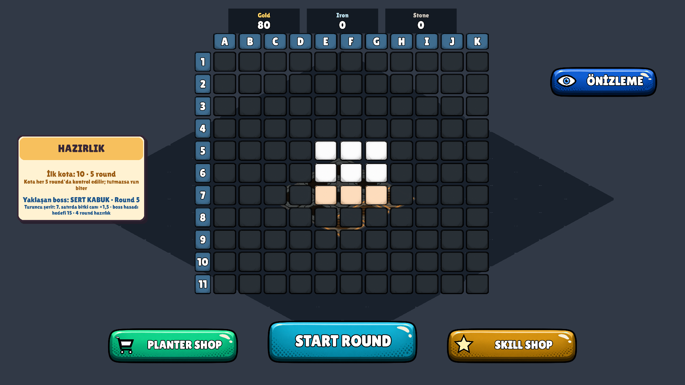
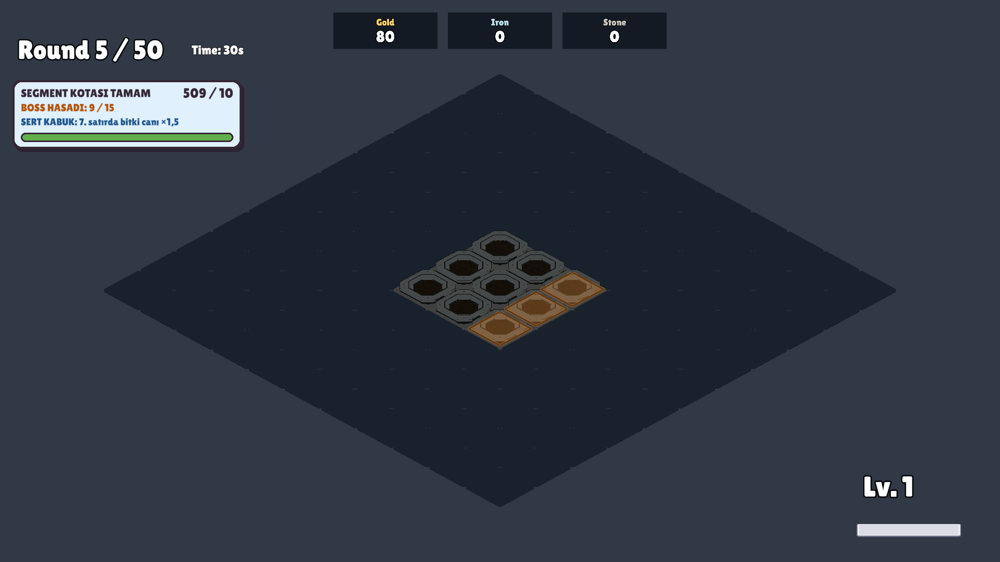
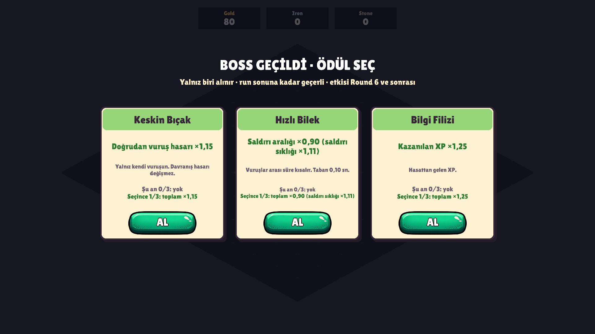
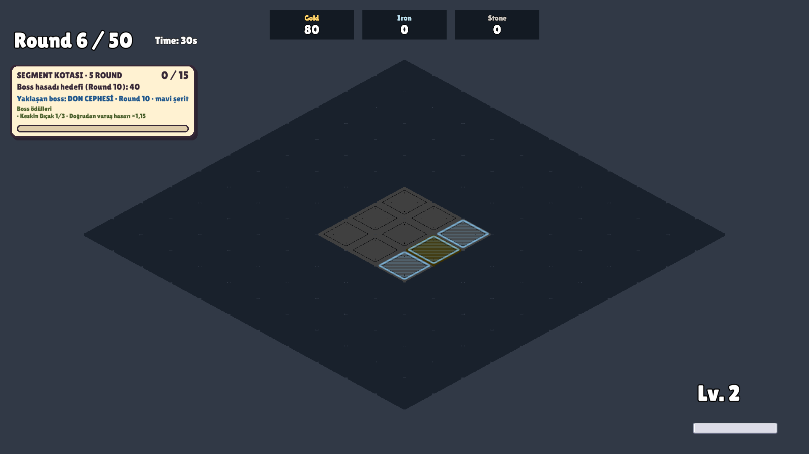
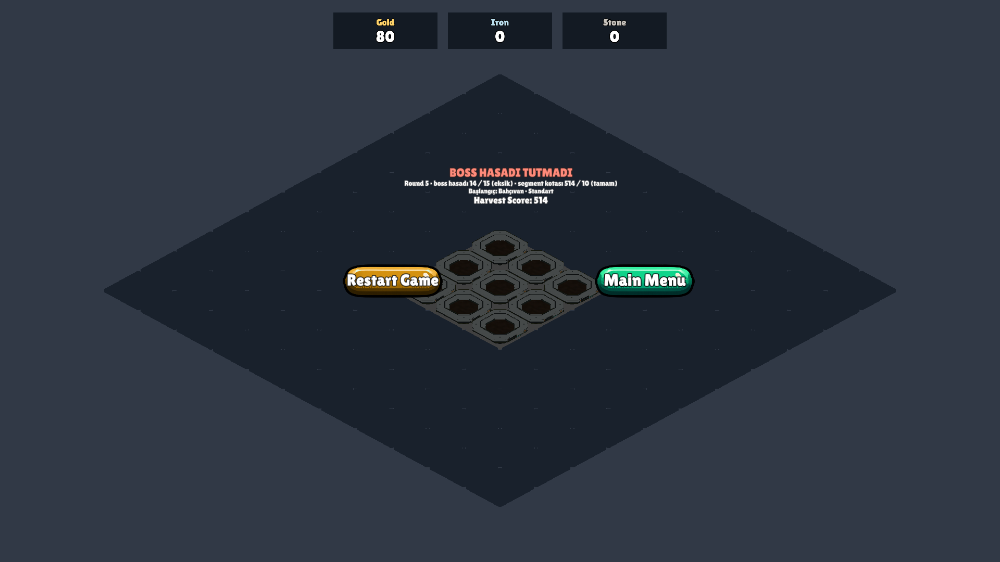

# Bölüm 3.4 — Her 5 round'da boss ve ilk ödül havuzu

1 Ekim 2026. Kaynak belgeler: [Bolum3-1-Run50-GucVeIcerikPlani.md](Bolum3-1-Run50-GucVeIcerikPlani.md), [Bolum3-2-Run50-ReferansOlcum.md](Bolum3-2-Run50-ReferansOlcum.md), [Bolum3-3-BaslangicSecimiVeGorevler.md](Bolum3-3-BaslangicSecimiVeGorevler.md).

Bu paket oynanabilir bir boss + ödül prototipi ekler. Skill tree, bitki canı, XP eğrisi, kart sayısı, round süresi ve segment kotaları değişmedi. **Boss hedefleri ve ödül değerleri ilk test değerleridir; dengelenmiş değildir.** "Test geçti" işlevin çalıştığını söyler, dengeyi değil; ikisi aşağıda ayrı bölümlerde (10 ve 11–12).

## 1. Gerçekten eklenenler

| İçerik | Durum |
|---|---|
| `Run50_BossPrototip` profili (50 round, 5 round'luk segment, normal ekonomi 80 / 0 / 0) | Oynanabilir; `Tools > Run Profili` menüsünde |
| Boss round'ları R5, R10 … R45 (9 boss); R50'de boss yok, mevcut bitiş akışı | Çalışıyor |
| Üç boss: Don Cephesi, Sert Kabuk, Sis + görünür yedek "Kuralsız Boss" | Çalışıyor |
| Veriyle tanımlı boss havuzu, seed'li seçim, arka arkaya tekrar yok | Çalışıyor |
| Ayrı başarı koşulu: yalnız boss round'unda sayılan "boss hasadı" | Çalışıyor |
| Boss ödülü ekranı: en çok 3 farklı seçenek, biri alınır | Çalışıyor |
| Altı ödül: Keskin Bıçak, Hızlı Bilek, Bereketli Toprak, Nadir Tohum, Bilgi Filizi, Kıvılcım | Çalışıyor; her biri en çok 3 kez |
| Hazırlık önizlemesi, boss HUD'u, alınan ödül listesi, sonuç ekranı satırları | Çalışıyor |

Eklenmeyenler (kapsam dışı): yeni çiftçi / tırpan, ağaç ve can eğrisi değişikliği, Canavar Bitki, imleç / yerleştirme sorunu.

## 2. Hangi profilden nasıl oynanır

1. Unity menüsü: **Tools > Run Profili > Run50 Boss Prototip · 50 round (boss + ödül)**. Seçili profil `Assets/Resources/RunProfileSelection.asset` içinde tutulur; bu dosyayı ben değiştirmedim (hâlâ senin seçtiğin Run50 Referans'ı gösteriyor). Menüden seçince değişir, eski profile aynı menüden dönülür.
2. MenuScene'den Play → **Oyna** → çiftçi ve tırpan seç (Bölüm 3.3 ekranı aynen çalışır) → **RUN'I BAŞLAT**.
3. Round 1–4 hazırlık, Round 5 boss. Her 5 round'da bir tekrar eder; Round 50 run'ı mevcut zafer akışıyla bitirir.

Bu profilde R10 uzmanlaşma seçimi açılmaz (`specializationAfterSegment: 0`). Eski profiller (Prototip10, Uzmanlasma20, Deney22_20, UzunRun130, Run50_Referans) boss verisi taşımaz ve eski akışla çalışır. İki sistem aynı arayüzü (`IRoundChoice`) kullanır ve panel sırası kodda tanımlıdır (kartlar → uzmanlaşma → boss ödülü); ileride aynı profilde birlikte açılmalarını engelleyen bir şey yok. İkisinin aynı round sonunda birlikte beklediği durum bu pakette **test edilmedi** (böyle bir profil yok).

## 3. Akış

| An | Ne olur |
|---|---|
| Segmentin ilk dört round'u (hazırlık) | Boss etkisi **yok**. Hazırlık kartı ve HUD boss'un adını, kuralını, bölgesini ve boss hasadı hedefini gösterir. Tarlada ve round haritasında bölge işaretlidir |
| Segmentin son round'u (boss round'u) | Giriş yazısı "BOSS: … · HASAT HEDEFİ N". Kural yalnız bu round'da etkindir. Boss hasadı sayacı 0'dan başlar |
| Round sonu | Süre bitince değerlendirilir (round erken bitmez). Segment kotası **ve** boss hasadı tutmalı |
| Başarılıysa | Bekleyen seviye kartları → boss ödülü ekranı → round özeti → hazırlık |
| Başarısızsa | Run biter; ekran hangi koşulun eksik olduğunu yazar. Ödül verilmez |

Hazırlık ekranı (boss adı, kural, hedef, haritada turuncu şerit):

Boss round'u HUD'u — segment kotası ve boss hasadı ayrı satırlarda:

Ödül ekranı:

Ödülden sonraki round'da HUD (sıradaki boss + alınan ödül listesi):

Boss hasadı tutmadığında:

Diğer görüntüler: [iki seçenek](Bolum3-4/BossReward_TwoOptions.png), [uygun ödül kalmadı](Bolum3-4/BossReward_None.png), [run sonu](Bolum3-4/Boss_RunEnd.png).

## 4. Bosslar

| Boss | Kural (yalnız boss round'unda) | Bölge | Asset değeri |
|---|---|---|---|
| Don Cephesi | Mavi şeritteki üretim noktaları ×1,5 yavaş üretir | Kenar şeridi, açık alanın %25'i | `spawnIntervalMultiplier 1.5`, `coverage 0.25` |
| Sert Kabuk | Turuncu şeritte bitki canı ×1,5 | Kenar şeridi, açık alanın %40'ı | `healthMultiplier 1.5`, `coverage 0.4` |
| Sis | Oyuncunun doğrudan vuruş yarıçapı ×0,85 | Bölge yok (bütün tarla) | `radiusMultiplier 0.85`, `minPlayerRadius 1.2` |
| Kuralsız Boss (yedek) | Kural yok; boss hasadı hedefi yine sayılır | — | Havuzda uygun boss kalmazsa |

**Sert Kabuk ayrıntısı**
- Boss round'unda şeritte doğan bitki: canı ×1,5 ile doğar (tek yuvarlama).
- Boss başladığı anda şeritte **yaşayan** bitkiler de sertleşir: azami can ×1,5 olur, mevcut can aynı oranda taşınır. Yaralı bitki doldurulmaz (4/8 → 6/12). Gerekçe: bitkiler round'lar arasında tarlada kalıyor; stok sertleşmeseydi boss'un ilk saniyeleri kuralsız geçerdi.
- Çarpan bir bitkiye ömründe bir kez uygulanır. Havuza dönen nesne başka yerde taban canla yeniden kullanılır.
- Boss bitince, run bitince ve yeniden başlatınca şeritte kalan bitkiler taban cana döner (oran korunur).
- Skor, kaynak ve XP bonusu yok. `PlantHealthScaling` ve bitki asset'leri değişmedi.

**Sis ayrıntısı**
- Yalnız oyuncunun `AreaRadius` değerine tek bir çarpan ekler; davranışların (patlama, kasırga, bumerang, elektrik) alanı ve hasarı aynı kalır. Boss bitince çarpan kaldırılır.
- `minPlayerRadius 1.2`: yarıçapı bunun altındaki oyuncuya Sis çıkmaz. Gerekçe: yarıçap 1,00'de Sis merkez nişanı 5 hedeften 1'e düşürür (ölçüm 11.1). Bu eşik Sis'i adil yapmaz; yalnız en sert durumu engeller. Sis'in ne zaman gerçekten etkili olduğu 12. bölümde.

**Don Cephesi ayrıntısı**
- Mevcut yavaşlatma aynen kullanıldı. Eski profillerde olay bütün segment boyunca etkindir (R6–10); yeni profilde yalnız boss round'unda. İki zamanlama aynı kodla çalışır (`SegmentEventTiming.WholeSegment` / `BossRound`).

**Bölge ve grid genişlemesi**
- Bölge duyuru anında, o an açık alanın dört kenar şeridinden biri olarak seçilir ve saklanır; önizlemede görülen bölge boss round'unda uygulanan bölgedir.
- Şerit grid'in sabit satır ya da sütunlarıdır. Grid sonradan genişlerse yeni açılan hücrelerden o satır / sütunda olanlar bölgeye girer; şerit yer değiştirmez ve kalınlaşmaz. (Sonuç: genişlemeden sonra şerit artık en dış kenar olmayabilir.)
- Seçilebiliyorsa bütün üretim noktalarını kapsayan şerit seçilmez.

## 5. Boss seçimi

- Havuz: `Assets/ScriptableObjects/Bosses/BossPool_Run50.asset` (boss + ağırlık; üçü de 1). Sabit üçlü döngü yok; A-B-A olabilir.
- Bir önceki boss aday dışıdır. Tek uygun aday önceki boss ise tekrar eder ve duyuruda "tekrar" diye belirtilir.
- Uygun aday hiç yoksa "KURALSIZ BOSS" seçilir ve hazırlık kartında böyle yazılır (sessizce atlanmaz).
- Seçim anı: segment 1 için run kurulurken; sonraki segmentler için bir önceki boss round'u bitince. Seçim ve bölge saklanır, sonradan değişmez.
- RNG: `Mix(runSeed, segment, tuz)` ile ayrı `System.Random`. Boss, bölge ve ödül teklifi ayrı tuz kullanır; hasat / kritik / kart akışının `UnityEngine.Random` durumuna dokunmaz. `bossSeed: 0` → her run yeni seed; sıfırdan farklı değer → aynı sıra (test ve tekrar için).

## 6. Boss hasadı hedefi

- Sayaç: boss round'u başındaki skordan itibaren kazanılan Harvest Score (`long`). Segment kotası dolu olsa bile 0'dan başlar.
- Eşitlik başarıdır (15 / 15 geçer, 14 / 15 kalır). Hedef dolunca round bitmez.
- Tablo profilde açık yazılıdır (`bossTargets`); gizli ölçekleme yok. Segment kotaları Run50_Referans ile aynıdır, yeniden dengelenmedi.

| Boss round'u | R5 | R10 | R15 | R20 | R25 | R30 | R35 | R40 | R45 |
|---|---|---|---|---|---|---|---|---|---|
| Boss hasadı hedefi | 15 | 40 | 60 | 80 | 105 | 120 | 135 | 150 | 170 |
| Segment kotası (değişmedi) | 10 | 15 | 20 | 30 | 45 | 65 | 95 | 130 | 200 |

Hedeflerin kaynağı ve geçici oluşu 11.2'de.

## 7. Ödüller

Başarılı her boss'tan sonra bir kez, en çok üç **farklı** seçenek; biri alınır. Ücretsiz yenileme yok. Etki bir sonraki round'dan itibaren geçerlidir. R50'den sonra ödül yok.

| Ödül | Tek alış | 3 alış | Kapsam |
|---|---|---|---|
| Keskin Bıçak | Doğrudan vuruş hasarı ×1,15 | ×1,52 | Yalnız oyuncunun vuruşu. `HarvestDamage` stat'ına girmez; davranış hasarı değişmez |
| Hızlı Bilek | Saldırı aralığı ×0,90 (sıklık ×1,11) | ×0,73 (sıklık ×1,37) | Oyuncu saldırı aralığı; taban 0,10 sn |
| Bereketli Toprak | Üretim aralığı ×0,90 | ×0,73 | Bütün saksılar (sonradan konanlar dahil) |
| Nadir Tohum | Nadirlik bonusu +8 puan | +24 puan | Bütün saksılar; yüzde puanı olarak eklenir |
| Bilgi Filizi | Kazanılan XP ×1,25 | ×1,95 | Hasat XP'si |
| Kıvılcım | Mevcut davranış şansları ×1,25 | ×1,95 | Patlama, kasırga, bumerang, elektrik. Şansı 0 olan saksıya şans açmaz; %100'ü aşmaz |

- Birikme: çarpanlar üst üste çarpılır, puanlar toplanır. Kart bunu iki satırla yazar: "Şu an 1/3: toplam ×1,15" ve "Seçince 2/3: toplam ×1,32".
- Ağırlıklar eşit (hepsi 1, asset'te).
- Uygunluk: sınırına gelen ödül sunulmaz. Şu an hiçbir şeyi değiştirmeyecek ödül sunulmaz (Kıvılcım: şansı 0 ile 100 arasında bir davranış saksısı yoksa; Hızlı Bilek: aralık tabandaysa). Üçten az uygun ödül varsa o kadar kart gösterilir. Hiç yoksa "Uygun ödül kalmadı" + **DEVAM**.
- Ödül seçilmeden sonraki round başlamaz. Çift tıklama ve paneli yeniden açma ikinci kez vermez.
- Yeni run, yeniden başlatma ve ana menü bütün ödülleri siler. Temizlik yalnız ödüllerin kendi eklediği etkileri kaldırır. Ödüller Bölüm 3.3 kaydına (`meta.json`) yazılmaz.

## 8. Ayar yerleri

| Ne | Nerede |
|---|---|
| Boss hasadı hedefleri | `Assets/ScriptableObjects/RunProfiles/Run50_BossPrototip.asset` → `bossTargets` (sırayla R5 … R45) |
| Segment kotaları | Aynı profil → `quotaStart`, `quotaGrowth` (ya da `segmentTargets`) |
| Sabit boss sırası (test için) | Aynı profil → `bossSeed` (0 = her run farklı) |
| Havuzdaki bosslar ve ağırlıkları | `Assets/ScriptableObjects/Bosses/BossPool_Run50.asset` |
| Don Cephesi yavaşlatma, şerit oranı | `Assets/ScriptableObjects/SegmentEvents/DonCephesi.asset` (eski profiller de bunu kullanır) |
| Sert Kabuk can çarpanı, şerit oranı | `Assets/ScriptableObjects/SegmentEvents/SertKabuk.asset` |
| Sis yarıçap çarpanı, seçilme eşiği | `Assets/ScriptableObjects/SegmentEvents/Sis.asset` |
| Ödül değerleri, azami alış, ağırlık, kart metni | `Assets/ScriptableObjects/BossRewards/*.asset` (`modifiersPerStack`, `directDamageMultiplier`, `maxStacks`, `weight`) |
| Havuzdaki ödüller, seçenek sayısı | `Assets/ScriptableObjects/BossRewards/BossRewardPool_Run50.asset` (`rewards`, `choices`) |

Yeni boss eklemek: `SegmentEventSO` türeten bir asset + çalışma zamanı sınıfı, havuza eklenir; `RoundManager`'a dokunulmaz. Mevcut etki türleriyle yetinen yeni ödül için kod gerekmez.

## 9. Mimari

| Parça | Dosya | Görev |
|---|---|---|
| Olay tabanı | `ScriptableObjects/SegmentEventSO.cs` | `SegmentEventTiming` (bütün segment / yalnız boss round'u), `SegmentEventRuntime` (etkinleşme, bitiş, doğan bitki can çarpanı), `EdgeBandZone` (ortak şerit seçimi) |
| Yönetici | `Managers/SegmentEventDirector.cs` | Eski olay listesi yolu aynen; profilde `bossPool` varsa boss kipi: seçim, önizleme, etkinleştirme, bitirme, tek temizlik yolu |
| Bosslar | `Managers/FrostFrontEvent.cs`, `HardShellEvent.cs`, `FogEvent.cs` (+ `FrostFrontSO`, `HardShellSO`, `FogSO`) | Kural başına bir sınıf |
| Havuz | `ScriptableObjects/BossPoolSO.cs` | Ağırlıklı seçim, tekrar kuralı, yedek boss |
| Profil | `ScriptableObjects/RunProfileSO.cs` | `bossPool`, `bossTargets`, `bossRewards`, `bossSeed` |
| Başarı koşulu | `Managers/RoundManager.cs` | `IsBossRound`, `BossTarget`, `BossProgress`, `EvaluateBoss()`; boss türüne göre dal yok |
| Ödüller | `Managers/BossRewardManager.cs`, `ScriptableObjects/BossRewardSO.cs`, `BossRewardPoolSO.cs` | `IRoundChoice`; teklif, tek sefer uygulama, birikme, sahipli temizlik |
| Can çarpanı | `Plants/PlantHealth.cs`, `Planters/PlantSpawner.cs` | Ömürde bir kez çarpan, oran korunur, havuzda sıfırlanır |
| Arayüz | `UI/SegmentEventText.cs`, `UI/inGameUIs/QuotaHUD.cs`, `UI/BossRewardPanelUI.cs`, `Managers/UIManager.cs`, `UI/RoundComplateUI/RunComplateUI.cs` | Önizleme metni, boss HUD'u, ödül ekranı, sonuç ekranı |
| Menü | `Assets/Editor/RunProfileMenu.cs` | Yeni profil satırı |

## 10. İşlev doğrulaması (denge değil)

Hepsi 1 Ekim 2026'da, son kodla, izole kopyada (`Library/VerificationProject`) batch Unity ile koşuldu. Açık editöre, seçili profile ve gerçek kayda dokunulmadı (koşu sonrası SHA-1 karşılaştırması: `RunProfileSelection.asset`, eski beş profil, `DonCephesi.asset`, `PlantHealthScaling.asset`, 12 bitki asset'i ve `meta.json` — hepsi aynı).

| Test | Sonuç | Log (`Library/VerificationProject/Logs/`) |
|---|---|---|
| `BossRewardVerification` (yeni) | **126 / 126** | `BossRewardVerification.txt` |
| `RunPrototypeVerification` (eski Don profili, R6–10 bütün segment) | 69 / 69 | `RunPrototypeVerification.txt` |
| `SpecializationVerification` (eski R10 uzmanlaşma) | 100 / 100 | `SpecializationVerification.txt` |
| `ElectricRevertVerification` | 40 / 40 | `ElectricRevertVerification.txt` |
| `StartLoadoutVerification` (Bölüm 3.3) | 87 / 87 | `StartLoadoutVerification.txt` |
| `Run50ReferenceVerification` (Bölüm 3.2) | 70 / 70 | `Run50ReferenceVerification.txt` |
| `MechanicsVerification` | 83 / 83 | `MechanicsVerification.txt` |
| `RoundPreviewVerification` | 47 / 47 | `RoundPreviewVerification.txt` |
| `HarvestBehaviorVerification` | 111 / 111 | `HarvestBehaviorVerification.txt` |
| `SimpleResonanceVerification` | 291 / 291 | `SimpleResonanceVerification.txt` |
| `OptionsMenuVerification` (ayarlar menüsü; `UIManager` değiştiği için) | PASS · 22 satır | `OptionsMenuVerification.txt` |

Run50 referans ölçümünün çıktısı Bölüm 3.2 tabanıyla satır satır aynı; tek fark Bölüm 3.3'ün eklediği "Başlangıç: …" satırları. Yani olay sistemindeki yeniden düzenleme eski profillerde hasadı ve skoru değiştirmedi.

**Koşulmayanlar:** `EconomyAnalyzerVerification`, `ModifierAudit`, `PacingProbe`, `SpeedElectricVerification` (emekli edilen şarjlı elektrik) ve simülatörün eski regresyon partileri bu pakette yeniden koşulmadı (dokunulan koda bağlı değiller). İnsan eliyle Play testi yapılmadı; aşağıdakilerin hepsi otomatik testtir.

`BossRewardVerification` neyi doğruluyor:

| Konu | Doğrulanan |
|---|---|
| Profil | 50 round, 5'lik segment, 80 / 0 / 0, kotalar Run50_Referans ile aynı, uzmanlaşma yok; eski profillerde boss verisi yok; menü satırı ve doğrulayıcısı |
| Zamanlama | Boss R1'den itibaren duyurulur, yalnız R5'te etkindir; R1–4'te çarpanlar 1, yarıçap aynı, boss sayacı kapalı |
| Önizleme = uygulanan | Önizlemedeki boss ve bölge R5'te aynen etkin; tarla işaretleri ve round haritası aynı hücreleri gösterir; aynı seed'le yeniden başlatınca aynı boss ve bölge |
| Ayrı koşul | Segment kotası 500 / 10 doluyken boss sayacı 0'dan başlar; 14 / 15 kaybeder, 15 / 15 geçer; hedef dolunca round sürer |
| Başarısızlık | Ödül yok; ekran "BOSS HASADI TUTMADI · boss hasadı 14 / 15 (eksik) · segment kotası 514 / 10 (tamam)" |
| Ödül akışı | Önce bekleyen seviye kartı, sonra ödül; seçilmeden round başlamaz; sunulmayan ödül alınamaz; tek tık = tek ödül; ikinci istek ve paneli yeniden açma çoğaltmaz |
| Kart metni | Etki, "Şu an n/3", "Seçince n+1/3: toplam …"; metin kutusuna sığar ve butonun üstüne taşmaz |
| Altı ödülün kapsamı | Keskin Bıçak yalnız doğrudan vuruş (elektrik 40 hasarda kalır, `HarvestDamage` değişmez); Usta Biçici ile tek çarpım tek yuvarlama; Hızlı Bilek 3 → 2,19 sn; üretim 5 → 4,5 sn; nadirlik +8; XP ×1,25; Kıvılcım %40 → %50, %90 → %100, 0 şans 0 kalır |
| Birikme ve sınır | 3 alış: ×1,52, ×0,729, +24; dördüncü reddedilir |
| Uygunluk | Kıvılcım davranış saksısı yokken ya da şans %100'ken sunulmaz; Hızlı Bilek tabandayken sunulmaz; iki uygun ödül → iki kart; hiç yok → "Uygun ödül kalmadı" + DEVAM |
| Yeni saksı | Ödülden sonra konan saksı aynı bonusları alır |
| Temizlik | Yeniden başlatma, aynı sahnede yeni run ve ana menü: ödül, modifier ve çarpan kalmaz; başka sistemin aynı değerli modifier'ı silinmez; ödüller kalıcı kayda yazılmaz |
| RNG | Boss seçimi, bölge ve ödül teklifi `UnityEngine.Random` durumunu değiştirmez; aynı seed aynı sonucu verir |
| Seçim kuralları | Arka arkaya aynı boss yok; A-B-A olur; tek aday önceki boss ise "tekrar" işaretlenir; aday yoksa görünür "KURALSIZ BOSS" ve hedef yine sayılır |
| Sert Kabuk | Stok 8 → 12; yaralı 4/8 → 6/12 (doldurulmaz); çarpan ikinci kez uygulanmaz; şeritte doğan 9 × 1,5 = 14; aynı havuz nesnesi şerit dışında 9 canla doğar; boss bitince, run bitince, yeniden başlatınca taban can; can asset'leri değişmedi |
| Sis | Yarıçap 1,00'de seçilmez; 1,30'da seçilir; 1,30 → 1,105, tek modifier; boss, run kaybı ve ana menü sonrası yarıçap ve modifier sayısı eski hâlinde |
| R50 | Boss yok, hedef yok, ödül yok; mevcut zafer ekranı alınan ödülleri listeler |

Test sırasında bulunup düzeltilenler: `Choose` azami alış sınırını denetlemiyordu (düzeltildi); ödül kartında "Seçince …" satırı butonun üstüne taşıyordu (kart yüksekliği ve metin düzeltildi, taşma kontrolü teste eklendi). Havuz testinde ilk sürüm başarısız oldu çünkü havuz nesneyi kare sonunda bırakıyor; test iki adıma bölündü, oyun kodu değişmedi.

## 11. Denge ölçümü (işlev testi değil)

Bu bölümdeki hiçbir sayı "geçti / kaldı" değildir. Değerlerin dengeli olduğunu göstermez; nerede dengesiz olduğunu gösterir.

**Koşullar**

| | Simülatör | Sahne |
|---|---|---|
| Araç | `RunSimulator.RunBossRoundScoreBatch` | `BossBalanceMeasurement` (GameScene, gerçek oyun kodu) |
| Çıktı | `Logs/RunSimBossRoundScore.txt` | `Logs/BossBalanceMeasurement.txt` |
| Kural | Run50_Referans, koşul B (kota tutmasa da run sürer), 100 seed, üç politika | Simülatörün temsilî run'larından 8 durum: Deneyimli ve Orta × R10 / R20 / R30 / R40 (Bölüm 3.2 ile aynı run'lar) |
| Boss / ödül | **Yok** (simülatör boss kuralını ve ödülü modellemez) | 13 varyant × 6 seed: boss yok, üç boss, altı ödül (birer), Keskin Bıçak ×3, Hızlı Bilek ×3, Sert Kabuk + Keskin Bıçak ×3 |
| Oyuncu | Politika modeli | Bot: en çok canlı bitki yakalayan nişan (hücre merkezi, iki hücre arası, köşe); eşitlikte en uzun süredir vurulmayan |
| Round | — | Tam round, kare 1/30 sn, tarla bir önceki round'un stoğuyla dolu başlar, nötr başlangıç (Bahçıvan + Standart) |

Sahne ölçümünde boss tek adaylı havuzla zorlanır (Sis eşik altındaki durumlarda da; tabloda "zorla"), ödüller oyunun uygunluk denetimi atlanarak verilir. Son iki koşu satır satır aynı sonucu verdi (tekrarlanabilir).

**Nişan kuralına duyarlılık:** ilk koşuda (4 seed) bot eşitliği "listede ilk nişan" ile bozuyordu; dolu tarlada hep aynı köşede kalıp davranış saksılarına hiç ulaşmadı ve Don Cephesi dört durumda hasadı **artırıyor** göründü (+%5 … +%18). Bağ kırma düzeltilince bu etki kayboldu. İlk koşu `Logs/BossBalanceMeasurement_ilkNisan.txt` olarak saklandı. Sonuç: ±%5 altındaki hasat farkları ve ±%15 altındaki skor farkları bu ölçümde gürültüdür (skor nadirlik zarına bağlı; tek seed aralığı ±%20).

### 11.1 Yarıçap ve gerçek hedef sayısı

5×5 dolu tarla, gerçek `AttackInRadius`. Hedef sayısı: hücre merkezine / iki hücre arasına / köşeye nişan.

| Yarıçap kaynağı | Tırpan | Yarıçap | Hedef | Sis'te yarıçap | Sis'te hedef | Sis seçilir mi | En iyi nişanda fark |
|---|---|---|---|---|---|---|---|
| Ağaç yok | Standart | 1,00 | 5 / 2 / 4 | 0,85 | 1 / 2 / 4 | Hayır (eşik altı) | −1 (merkez nişanda −4) |
| Ağaç yok | Dar Kesim | 0,75 | 1 / 2 / 4 | 0,64 | 1 / 2 / 4 | Hayır | 0 |
| Geniş Süpürüş (+%30) | Standart | 1,30 | 5 / 6 / 4 | 1,105 | 5 / 2 / 4 | **Evet** | **−1** (6 → 5) |
| Geniş Süpürüş (+%30) | Dar Kesim | 0,975 | 1 / 2 / 4 | 0,83 | 1 / 2 / 4 | Hayır | 0 |
| Geniş Tarama (+%60) | Standart | 1,60 | 5 / 6 / 4 | 1,36 | 5 / 6 / 4 | Evet | **0** |
| Geniş Tarama (+%60) | Dar Kesim | 1,20 | 5 / 2 / 4 | 1,02 | 5 / 2 / 4 | Evet | **0** |

- Ölçülen noktalar: 1,30'da etkili (6 → 5), 1,20 ve 1,60'ta etkisiz. Hücre eşiğinden (Bölüm 3.2: yarıçap 1,24'te 5 → 6 hedef) türetilen aralık: Sis yalnız yarıçap 1,24 – 1,46 arasında hedef sayısını değiştirir. Eşik (1,20) ile 1,24 arasında ve 1,46'nın üstünde seçilir ama hiçbir nişanda hedef sayısını değiştirmez. (Kartlar yarıçapı küçük adımlarla da artırabiliyor; ölçülen run'larda R20 yarıçapı 1,03.)
- Dar Kesim ile Sis hiçbir ağaç seviyesinde hedef sayısını değiştirmez: iki seviyede seçilemez, üçüncüsünde seçilir ve etkisizdir.
- Yarıçap ≥ 1,2 koşulu yalnız "merkez nişan 5 → 1" durumunu engelliyor. Sis'in adil ya da anlamlı olduğunu göstermiyor.

### 11.2 Boss seçimi ve yedek kullanımı

Havuzun kendi seçim kuralı, 1000 seed × 9 boss, yarıçap run boyunca sabit varsayıldı.

| Başlangıç / ağaç (yarıçap) | Yedek (kuralsız) | Tekrar | Dağılım |
|---|---|---|---|
| Dar Kesim (0,75) | 0 / 9000 | 0 / 9000 | Don %50, Sert Kabuk %50 |
| Standart (1,00) | 0 / 9000 | 0 / 9000 | Don %50, Sert Kabuk %50 |
| Dar Kesim + Geniş Süpürüş (0,975) | 0 / 9000 | 0 / 9000 | Don %50, Sert Kabuk %50 |
| Standart + Geniş Süpürüş (1,30) | 0 / 9000 | 0 / 9000 | Don %34, Sert Kabuk %34, Sis %32 |
| Standart + Geniş Tarama (1,60) | 0 / 9000 | 0 / 9000 | Don %34, Sert Kabuk %34, Sis %32 |

Yedek "Kuralsız Boss" geçerli başlangıçların hiçbirinde kullanılmadı: Don ve Sert Kabuk'un uygunluk koşulu yok, bu yüzden her zaman en az iki aday var. Yedek yalnız özel bir havuzla (testte: yalnız Sis, yarıçap 1,00) ortaya çıkıyor. Yan etki: yarıçap 1,2'nin altındayken (Standart'ta ilk yarıçap node'una kadar, Dar Kesim'de iki node da alınana kadar) bosslar Don ↔ Sert Kabuk diye sırayla değişir; çeşitlilik iki boss'a iner.

### 11.3 Hedef tablosunun kaynağı ve geçme oranı (simülatör, boss ve ödül yok)

Hedefler ≈ 0,6 × "Yeni" politikanın o round'daki medyan round skoru (21 → 15, 68 → 40, 104 → 60, 130 → 80, 178 → 105, 203 → 120, 224 → 135, 250 → 150, 285 → 170). Geçici bir tablodur.

| Round | Hedef | Yeni P10 / P50 / P90 | Yeni: bu boss'u geçen | Yeni: buraya kadar hepsini geçen | Orta P50 (hedefin katı) | Deneyimli P50 (hedefin katı) |
|---|---|---|---|---|---|---|
| R5 | 15 | 10 / 21 / 66 | 80 / 100 | 80 / 100 | 78 (×5,2) | 103 (×6,9) |
| R10 | 40 | 13 / 68 / 111 | 65 / 100 | 60 / 100 | 116 (×2,9) | 156 (×3,9) |
| R15 | 60 | 24 / 104 / 155 | 77 / 100 | 53 / 100 | 107 (×1,8) | 437 (×7,3) |
| R20 | 80 | 35 / 130 / 214 | 84 / 100 | 52 / 100 | 156 (×2,0) | 1432 (×17,9) |
| R25 | 105 | 50 / 178 / 393 | 85 / 100 | 52 / 100 | 215 (×2,0) | 1937 (×18,4) |
| R30 | 120 | 72 / 203 / 579 | 88 / 100 | 52 / 100 | 552 (×4,6) | 2285 (×19,0) |
| R35 | 135 | 140 / 224 / 695 | 90 / 100 | 52 / 100 | 1428 (×10,6) | 2672 (×19,8) |
| R40 | 150 | 178 / 250 / 742 | 90 / 100 | 52 / 100 | 1942 (×12,9) | 3090 (×20,6) |
| R45 | 170 | 189 / 285 / 808 | 90 / 100 | 52 / 100 | 2584 (×15,2) | 4204 (×24,7) |

Orta ve Deneyimli her boss'ta 100 / 100 geçiyor. Yeni politikada run'ların %48'i dokuz boss'un en az birinde kalıyor; kayıpların çoğu R5 ve R10'da (boss kuralı uygulanmadan).

### 11.4 Sahne: boss açık / kapalı

"Boss yok"a göre değişim: **hasat · round skoru**. Parantez içi: boss yok satırındaki mutlak değer.

| Durum (yarıçap) | Boss yok (hasat · skor) | Don Cephesi | Sert Kabuk | Sis |
|---|---|---|---|---|
| Deneyimli R10 (1,00) | 63 · 171 | −%8,2 · −%18,8 | 0 · 0 | −%11,1 · −%24,9 (zorla) |
| Deneyimli R20 (1,03) | 119 · 1448 | −%0,8 · +%6,5 | 0 · −%9,1 | −%15,0 · −%22,6 (zorla) |
| Deneyimli R30 (1,30) | 157 · 1887 | +%2,0 · +%8,8 | −%2,4 · −%3,2 | −%4,8 · +%9,9 |
| Deneyimli R40 (1,30) | 214 · 2802 | −%0,5 · +%6,0 | 0 · 0 | **+%7,2 · +%22,9** |
| Orta R10 (1,00) | 54 · 115 | −%8,6 · −%1,6 | 0 · 0 | −%1,9 · −%3,9 (zorla) |
| Orta R20 (1,03) | 123 · 250 | −%0,8 · +%2,9 | −%2,7 · −%5,0 | −%8,8 · −%10,4 (zorla) |
| Orta R30 (1,30) | 206 · 1547 | −%4,6 · −%21,3 | −%5,8 · −%22,0 | −%24,1 · −%26,4 |
| Orta R40 (1,30) | 303 · 4968 | −%7,3 · −%9,3 | −%2,0 · −%2,6 | −%22,6 · −%28,4 |

- Sis, yarıçap 1,30'da doğrudan hasadı her durumda ~%17 düşürüyor (121 → 101, 159 → 131, 125 → 105, 150 → 125): 6 → 5 hedefle uyumlu. Toplam hasat ise build'e bağlı: Deneyimli R40'ta davranış hasadı 55 → 99'a çıktığı için toplam **arttı**.
- Tarla doluluk oranı R20'den sonra %64 – %85: üretim fazlası var. Don Cephesi'nin yavaşlattığı üretim zaten kullanılmıyor.

**Boss hasadı hedefini tamamlama:** 8 durum × 13 varyant × 6 seed = 624 round'un hepsi hedefi geçti. En dar pay:

| Durum | Hedef | Bütün varyantlarda en düşük tek round skoru | Kat |
|---|---|---|---|
| Deneyimli R10 | 40 | 108 (Sis) | ×2,7 |
| Orta R10 | 40 | 78 (boss yok) | ×1,95 |
| Deneyimli R20 | 80 | 785 (Sis) | ×9,8 |
| Orta R20 | 80 | 187 (Sis) | ×2,3 |
| Deneyimli R30 | 120 | 1381 (Sert Kabuk) | ×11,5 |
| Orta R30 | 120 | 874 (Sis) | ×7,3 |
| Deneyimli R40 | 150 | 2196 (Bereketli Toprak ödülü) | ×14,6 |
| Orta R40 | 150 | 2744 (Sis) | ×18,3 |

### 11.5 Sahne: ödül öncesi / sonrası

"Boss yok, ödül yok"a göre **hasat** değişimi (Nadir Tohum ve Bilgi Filizi için kendi ölçüleri). D = Deneyimli, O = Orta.

| Ödül | D-R10 | D-R20 | D-R30 | D-R40 | O-R10 | O-R20 | O-R30 | O-R40 |
|---|---|---|---|---|---|---|---|---|
| Keskin Bıçak | 0 | +%1,7 | +%0,6 | 0 | 0 | 0 | −%0,2 | 0 |
| Keskin Bıçak ×3 | 0 | +%2,5 | +%2,7 | 0 | 0 | 0 | −%2,8 | 0 |
| Hızlı Bilek | **+%14,3** | **+%13,9** | **+%11,4** | **+%10,3** | **+%13,0** | **+%9,6** | **+%9,0** | **+%6,7** |
| Hızlı Bilek ×3 | +%3,2 | +%37,5 | +%43,3 | +%46,8 | +%16,7 | +%40,2 | +%26,5 | +%22,4 |
| Bereketli Toprak | 0 | +%7,0 | +%0,7 | +%1,7 | 0 | −%1,9 | +%1,5 | +%3,0 |
| Nadir Tohum (skor) | +%1,5 | +%4,8 | +%5,4 | +%4,0 | +%1,2 | +%3,4 | +%0,1 | +%5,1 |
| Bilgi Filizi (XP) | +%25,2 | +%24,9 | +%25,5 | +%25,6 | +%25,2 | +%25,1 | +%26,1 | +%25,5 |
| Kıvılcım | 0 (sunulmaz) | +%3,5 | −%1,6 | +%2,2 | 0 (sunulmaz) | 0 | +%0,2 | +%2,4 |

- Bilgi Filizi hasadı ve skoru değiştirmez; XP'nin seviye ve karta dönüşen uzun vadeli değeri bu tek round'luk ölçümde **yok**.
- Kıvılcım R10 durumlarında sunulmaz (davranış saksısı yok); R20 – R40 durumlarında oyunun kuralına göre sunulabilir.
- Deneyimli R10'da Hızlı Bilek ×3 (+%3,2) tek alıştan (+%14,3) az verdi: tarla küçük (9 üretim noktası), bitki yeniden doğmadan gelen fazladan vuruş boşa gidiyor. Saldırı aralığının 3 → 2,19 sn olduğu işlev testinde doğrulandı; bu bir hata değil, küçük tarlada saldırı hızının üretimi aşması.

### 11.6 Sert Kabuk'un gerçek vuruş sayısına etkisi

Şeritte doğrudan vuruşla ölen bitkiler için ortalama vuruş sayısı (parantez: şerit dışı) ve taze bitkide tek vuruşta ölme oranı.

| Durum | Oyuncu hasarı | Şeritte vuruş / öldürme | Şeritte tek vuruş | Hasat (boss yok'a göre) | Keskin Bıçak ×3 ile: vuruş / öldürme · tek vuruş · hasat (boss yok'a göre) |
|---|---|---|---|---|---|
| Deneyimli R10 | 61 | 1,00 (1,00) | %100 | 0 | 1,00 · %100 · 0 |
| Deneyimli R20 | 67 | 1,07 (1,01) | %84 | 0 | 1,02 · %95 · +%0,7 |
| Deneyimli R30 | 92 | 1,11 (1,02) | %82 | −%2,4 | 1,03 · %94 · +%2,0 |
| Deneyimli R40 | 682 | 1,00 (1,00) | %98 | 0 | 1,00 · %98 · 0 |
| Orta R10 | 61 | 1,00 (1,00) | %100 | 0 | 1,00 · %100 · 0 |
| Orta R20 | 64 | 1,00 (1,00) | %99 | −%2,7 | 1,00 · %100 · −%2,4 |
| Orta R30 | 92 | 1,01 (1,00) | %93 | −%5,8 | 1,00 · %99 · −%1,7 |
| Orta R40 | 575 | 1,00 (1,00) | %100 | −%2,0 | 1,00 · %100 · −%2,0 |

Sert Kabuk hasar yatırımını anlamlı kılmıyor. Sekiz durumun altısında şeritte vuruş / öldürme 1,00 – 1,01: bitki ×1,5 canla da tek vuruşta ölüyor. Etkinin göründüğü iki durumda (Deneyimli R20, R30) ek vuruş %7 – %11; Keskin Bıçak'ı üç kez almak bunu geri alıyor ama kazancı en çok +%4,6 hasat (153 → 160). Orta'daki küçük düşüşler doğrudan vuruştan değil, sertleşen bitkilerin davranış hasarından sağ çıkmasından geliyor (Orta R30: davranış hasadı 81 → 72).

## 12. Ölçümlerin gösterdiği denge sorunları

1. **Hedef tablosu aynı anda hem çok kolay hem çok sert.** Deneyimli build hedefi 3,9 – 25 kat, Orta 1,8 – 15 kat aşıyor (simülatör medyanı); sahnede boss etkinken de en dar pay ×1,95. Aynı tablo Yeni politikanın %20'sini R5'te, toplamda %48'ini eliyor. Sabit ve tek bir tablo bu iki ucu birlikte karşılayamıyor. Bu, Bölüm 3.2'deki "kota baskı yapmıyor" bulgusunun boss tarafındaki karşılığı.
2. **Hiçbir boss hedefi tehdit etmiyor.** En büyük hasat düşüşü −%24 (Sis, Orta R30); hedef payı o durumda ×7. Deneyimli ve Orta build için boss round'u şu an yalnız bir duyuru.
3. **Don Cephesi R20'den sonra ölçülemiyor.** Hasat etkisi −%7 ile +%2 arasında; ilk koşuda aynı durumlarda −%5 ile +%18 arasındaydı. Nişan kuralı değişince işaret değiştiren bir etki güvenilir değildir. Sebep üretim fazlası. Yalnız R10'da (küçük tarla) tutarlı: ~−%8.
4. **Sert Kabuk etkisiz.** Hasar doygunluğu yüzünden ×1,5 can altı durumda görünmüyor; hasar yatırımına anlam katmıyor (11.6).
5. **Sis dar bir yarıçap aralığında var.** Yalnız 1,24 – 1,46'da hedef sayısını değiştiriyor. Yarıçap 1,6'da ve Dar Kesim'in seçilebildiği tek seviyede seçilip hiçbir şey yapmıyor; Dar Kesim'in diğer seviyelerinde hiç çıkmıyor. Etkili olduğu yerde sonuç build'e göre −%24 ile +%7 arasında.
6. **Ödüller arasında gerçek seçim yok.** Hızlı Bilek her durumda en iyi (tek alışta +%7 … +%14 hasat; üç alışta R20 ve sonrasında +%22 … +%47). Keskin Bıçak ≈ 0 (hasar doygunluğu), Bereketli Toprak ≈ 0 (üretim fazlası), Kıvılcım ≈ 0, Nadir Tohum +%0 – 5 skor. Bölüm 3.2'nin darboğazı (saldırı sıklığı) burada da belirleyici: darboğazı açan tek ödül kazanıyor.
7. **Küçük tarlada saldırı hızı da boşa gidebiliyor** (Deneyimli R10: ×3 alış +%3,2). Erken alınan Hızlı Bilek'in değeri tarla büyüyene kadar düşük.
8. **Çeşitlilik:** yarıçapı 1,2'nin altında kalan run'larda yalnız iki boss dönüyor (Don ↔ Sert Kabuk), ikisi de ölçümde zayıf.

Bu pakette bunların hiçbiri düzeltilmedi (istenen: geçici tablo, ölçüm ve rapor). Olası yönler — karar senin: hedefi oyuncunun önceki segment skoruna bağlamak ya da iki ayrı tablo; boss kurallarını üretim yerine saldırı sıklığına / hedef sayısına dokundurmak; Sis'i çarpan yerine "en iyi nişanda −1 hedef" garantisiyle tanımlamak; Sert Kabuk çarpanını hasar doygunluğunu kıracak kadar büyütmek.

## 13. Kalan sınırlamalar

- **İnsan testi yok.** Bütün doğrulama batch kipinde otomatik. Görüntüler 1920×1080 batch çizimidir; gerçek ekranda okunurluk, his ve tempo senin Play kontrolüne kalıyor.
- **Baştan sona 50 round'luk boss run'ı oynanmadı** (ne bot ne insan). İşlev testi round'lara atlar ve yer yer skoru doğrudan ekler; ölçüm tek tek round'ları ölçer.
- **Ölçüm kapsamı:** bot insan değildir; 6 seed; yalnız Deneyimli ve Orta, R10 – R40. Yeni politika ve R5 sahnede ölçülmedi (yalnız simülatörde). Ödüller tek round'da ölçüldü: birikimli etkiler (XP → seviye → kart, üretimin ekonomiye etkisi) ve boss + ödül birleşimleri (Sert Kabuk + Keskin Bıçak ×3 dışında) ölçülmedi. Dar Kesim'le sahne round ölçümü yapılmadı; yalnız yarıçap tablosu (11.1).
- **Simülatör** boss kuralını ve ödülleri modellemez; 11.3'teki geçme oranları boss'suz skorlardır.
- Uzmanlaşma ve boss ödülünün aynı round sonunda birlikte beklemesi test edilmedi (böyle bir profil yok).
- Grid genişledikten sonra daha önce seçilmiş şerit artık en dış kenarda olmayabilir.
- Sis'in tarlada bölge işareti yok (bütün tarlayı etkiler); yalnız hazırlık kartı, HUD satırı ve küçülen imleç halkasıyla görünür.
- `bossSeed: 0` iken "Yeniden başlat" yeni bir boss sırası üretir (aynı sırayı tekrar oynamak için profilde seed verilmeli).
- Run sonu ekranındaki satırlar küçük puntoyla yazılıyor (mevcut ekran düzeni; bu pakette değiştirilmedi).
- İzole kopyada Unity iki kez açılışta takıldı (paket kaydından sonra, script derlemesinden önce; oyun kodu yüklenmeden). Yalnız o batch süreci sonlandırılıp koşu tekrarlandı ve geçti. Açık editöre dokunulmadı.

## 14. Kısa Play kontrolü (5 – 10 dk)

1. **Tools > Run Profili > Run50 Boss Prototip · 50 round (boss + ödül)**.
2. MenuScene → Play → **Oyna** → Bahçıvan + Standart → **RUN'I BAŞLAT**.
3. Round 1 hazırlığı: soldaki kartta "Yaklaşan boss: … · Round 5", kural ve "boss hasadı hedefi 15" yazıyor mu? Haritada ve tarlada renkli şerit var mı (Don mavi, Sert Kabuk turuncu)? Standart tırpanla ilk boss Sis olmamalı.
4. Round 1 – 4: HUD'da "SEGMENT KOTASI" ve altında "Boss hasadı hedefi (Round 5): 15" ayrı okunuyor mu? Şeritte henüz etki olmamalı.
5. Round 5: giriş yazısı "BOSS: … · HASAT HEDEFİ 15" çıkıyor mu? "BOSS HASADI: 0 / 15" sıfırdan mı başlıyor (segment kotası dolu olsa bile)?
6. Round 5 sonu: önce seviye kartları, sonra "BOSS GEÇİLDİ · ÖDÜL SEÇ". Üç farklı kart, "Şu an 0/3" ve "Seçince 1/3" satırları okunuyor mu? Seçmeden round başlatılamıyor mu?
7. Round 6: HUD'da "Boss ödülleri · …" satırı ve yeni "Yaklaşan boss" (ilkinden farklı) var mı?
8. Bilerek kaybet: Round 10'da hiç vurma → "BOSS HASADI TUTMADI · … (eksik) · segment kotası … (tamam)".
9. **Restart Game**: ödül listesi boş ve vuruş / hız eski hâlinde mi?
10. Tools > Run Profili'nden eski bir profile dön (ör. Prototip 10): Don R6 – 10 boyunca etkin, ödül ekranı yok.

Asıl bakmanı istediğim his sorusu: boss round'u diğer round'lardan farklı hissettiriyor mu? Ölçüme göre güçlü build'de hissettirmemesi beklenir (12. bölüm, madde 2).

## 15. Değişen dosyalar

**Yeni (oyun):** `Assets/Scripts/ScriptableObjects/{BossPoolSO,BossRewardSO,BossRewardPoolSO,HardShellSO,FogSO}.cs`, `Assets/Scripts/Managers/{BossRewardManager,HardShellEvent,FogEvent}.cs`, `Assets/Scripts/UI/BossRewardPanelUI.cs`.

**Yeni (asset):** `Assets/ScriptableObjects/RunProfiles/Run50_BossPrototip.asset`, `Assets/ScriptableObjects/Bosses/BossPool_Run50.asset`, `Assets/ScriptableObjects/SegmentEvents/{SertKabuk,Sis}.asset`, `Assets/ScriptableObjects/BossRewards/{KeskinBicak,HizliBilek,BereketliToprak,NadirTohum,BilgiFilizi,Kivilcim,BossRewardPool_Run50}.asset`.

**Değişen (oyun):** `SegmentEventSO.cs`, `FrostFrontSO.cs`, `RunProfileSO.cs`, `SegmentEventDirector.cs`, `FrostFrontEvent.cs`, `RoundManager.cs`, `SpecializationManager.cs`, `UIManager.cs`, `PlayerController.cs`, `PlantHealth.cs`, `PlantSpawner.cs`, `SegmentEventText.cs`, `QuotaHUD.cs`, `RunComplateUI.cs`, `Assets/Editor/RunProfileMenu.cs`.

**Test ve ölçüm (`Tools/Verification/Editor`):** `BossRewardVerification.cs` (yeni, işlev), `BossBalanceMeasurement.cs` (yeni, ölçüm), `RunSimulator.cs` (`RunBossRoundScoreBatch` eklendi).

**Değişmeyen:** `RunProfileSelection.asset`, eski profiller, `DonCephesi.asset`, `PlantHealthScaling.asset`, bitki asset'leri, MenuScene / GameScene dosyaları, gerçek kayıt (`meta.json`). Commit atılmadı.
