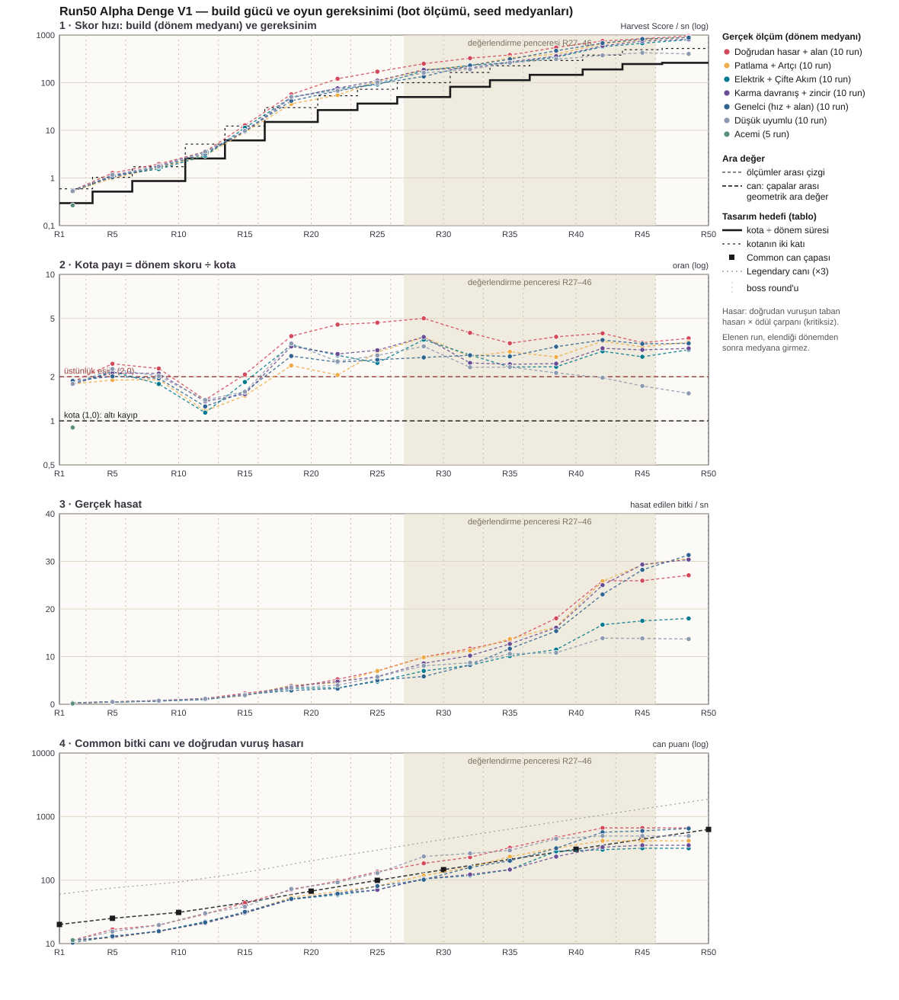

# Bölüm 3.7.8 — P8: 50–60 dakika aktif run ve ana güç eğrisi

Tarih: 4 Ekim 2026. Aday profil: **Run50_AlphaDengeV1** (ilk alpha denge adayı). Commit yok. P9'a geçilmedi.
Bütün sayılar **bot ölçümüdür**; insan Play testi yapılmadı. "Kopma hissi", seçim yorgunluğu ve tekrar oynama isteği bu belgeyle
kapanmaz.

## Kısa sonuç

- **Yapılan:** `Run50_AlphaDengeV1` oynanabilir. Round süreleri profil verisinden geliyor (R1–5 45 sn, R6–10 55 sn, R11–50 65 sn;
  toplam **51 dk 40 sn** aktif süre); aktif oyun, seçim ekranları, mağaza, hazırlık ve duraklama ayrı sayaçlarda. Can eğrisi ve
  hedefler bu süreye göre ölçümle yeniden kuruldu. Ölçüm: başlangıç → iki ayar turu → son doğrulama (110 run, gerçek hedefler).
- **Tutan:** teknik kabulün tamamı. Hasar artık oyun boyunca işe yarıyor (süre uzayınca her build R20'den itibaren her şeyi
  tekliyordu). R16'yı geçen run'lar R17'den R50'ye kadar medyanda kotanın 2–5 katını yapıyor; dört yolun dördünde de.
- **Tutmayan:** "en az iki yolda belirgin üstünlük penceresi" ölçütü (10 seed'in 7'si) yalnız **doğrudan hasar + alan** yolunda
  tutuyor (8 / 10). Patlama, elektrik ve karma davranış yolları run'larının %40–50'sini **R13–16 kotasında** kaybediyor ve
  kazanma oranında düşük uyumlu bottan ayrışmıyor. Kotalar R11–16'da sıkı, R17–36'da gevşek kaldı. İki ayar turu hakkı bittiği
  için dokunmadım; karar senin (14. bölüm).
- **Zincir:** aynı durumda hasadı %7–11 artırıyor; gerçek run'da yerine alınan ödülle aynı değerde (×1,03). Sınırlayan şey
  çarpanlar değil; izinli aralıkta yükseltmek +%4–9 veriyor. Çarpanlar değişmedi; zincir bir kırılma ödülü değil.
- **XP ve seçim yükü (P7'nin açık maddeleri):** XP yatırımı yeni sürelerle R40–50'de geri ödüyor (45 sn'de hiç ödemiyordu) ama
  orta oyunda risk. Seçim sayısı 339–386 (XP'siz 243–250). İkisi de açık.
- **Ölçümden sonra kendi kurallarımı üç kez değiştirdim** (4.4): hedef kuralının dayanağı, ilk boss tavanı, can eğrisi seçim
  kuralı. Üçü de gerekçesiyle yazılı.
- **İnsan Play testi yapılmadı.** Sayılar bot ölçümüdür; bot her vuruşta en iyi nişanı bulur.

Ölçümden önce yazılan tanımlar ve sonradan yaptığım kural değişiklikleri: [OlcumOncesi-Tanimlar.md](Bolum3-7-8/OlcumOncesi-Tanimlar.md).

---

## 1. Nasıl oynarım?

1. Unity'de **Tools > Run Profili > "Run50 Alpha Denge V1 · 50 round (51:40 aktif süre, ilk alpha denge adayı)"**.
2. Play. Round sayacı R1–5'te 45 sn, R6–10'da 55 sn, R11–50'de 65 sn'den başlar.
3. Run bitince (kazanç ya da kayıp) sonuç ekranının altında süre satırı çıkar:
   `Aktif oynanış 51:40 · seçimler … · mağaza ve hazırlık …` (bekleme olduysa `seviye hesaplama`, pencere arkada kaldıysa `duraklama`).

Seçili profil bu teslimde değiştirilmedi (hâlâ kullanıcının seçtiği profil); yeni profili menüden sen seçersin.

## 2. Değişen ayarlar ve tek düzenleme kaynakları

Yeni profile ait her sayı **tek bir dosyada** düzenlenir: [`Tools/Balance/AlphaDengeV1/alpha_denge_v1_params.py`](../Tools/Balance/AlphaDengeV1/alpha_denge_v1_params.py).
Asset'ler `python make_alpha_denge_v1.py` ile üretilir (Inspector'da elle değişiklik bir sonraki üretimi durdurur).

| Ne | Run50_XPV1 (başlangıç) | Run50_AlphaDengeV1 | Parametre |
|---|---|---|---|
| Round süresi | her round 45 sn (toplam 2 250 sn) | R1–5 45 sn · R6–10 55 sn · R11–50 65 sn (toplam **3 100 sn = 51 dk 40 sn**) | `ROUND_DURATIONS` |
| Bitki canı (Common) | Denge V1 eğrisi (R50: 215) | R15'ten itibaren daha dik (R50: 627); R1–10 aynı | `HP_ANCHORS` |
| Dönem kotaları | Takvim V1 aktarım tablosu (27 … 4 800) | yeniden kuruldu (40 … 68 000) | `QUOTA_TARGETS` |
| Boss hasat hedefleri | aktarım tablosu (5 … 1 100) | yeniden kuruldu (10 … 13 000) | `BOSS_TARGETS` |
| Zincir Hasat çarpanları | şans 0,75 / 0,50 · hasar 0,75 / 0,50 | **değişmedi** (gerekçe: 7. bölüm) | `CHAIN_CHANCE`, `CHAIN_DAMAGE` |
| Diğer ödüllerin değerleri | — | **değişmedi** | `REWARD_OVERRIDES` (boş) |
| XP tablosu | XP V1 tablosu | **değişmedi** (aynı asset) | `XP_TABLE_OVERRIDES` (boş) |
| Ağaç fiyatları ve kademe değerleri | Denge V1 ağacı | **değişmedi** | — |

Aynen korunanlar (XP V1'den gelir, bu profilden değiştirilemez): 50 round ve 15 boss tarihi, level başına 3 seçim, bedelli
ödüllerin seçim hakkına etkisi, tile → yükseltme → temel güç akışı, toplanan XP kartı kuralı, tablo sonrası büyüyen level
maliyeti, zincirin tekrar engeli / nesil sayısı / bütçeleri, ödül havuzunun içeriği ve ağırlıkları, başlangıç ekonomisi.
Eski profillerin hiçbir verisi değişmedi (değişen can eğrisi yeni profilin kendi kopyasıdır).

Üretilen dosyalar: `Assets/ScriptableObjects/RunProfiles/Run50_AlphaDengeV1.asset`,
`Assets/ScriptableObjects/Balance/AlphaDengeV1/RunBalance_AlphaDengeV1.asset` ve `PlantHealth_AlphaDengeV1.asset`.
Ödül ya da XP değeri değişirse üretici o asset'in bu profile ait kopyasını da yazar (şu an gerek yok).

### Kod değişiklikleri

- **Round süresi tablosu:** `RunProfileSO.roundDurations` (satır: "bu round'dan itibaren şu kadar saniye"). Hesap tek yerde:
  `RoundDurations` (`Assets/Scripts/Managers/RoundDurations.cs`); `RoundManager` round numarasına göre dallanmaz, tabloya sorar.
  Sınırlar 30–120 sn; geçersiz tablo (sırasız, eksik, sınır dışı, sabit süreyle birlikte) düzeltilmez: run başlamaz ve hata yazılır.
  Tablo boşsa profil eski yoldan çalışır (sabit süre ya da süre yükseltmeleri + tempo); 65 sn'lik round eski 60 sn sınırına
  takılmaz ve hıza dönüşmez.
- **Süre sayaçları:** `RunClock` (`Assets/Scripts/Managers/RunClock.cs`). Aktif süre (round sayacından düşen), aynı karelerde
  gerçekte geçen süre, level hesaplama bekleyişi, kart seçimi, boss ödülü seçimi, mağaza, hazırlık ve duraklama **ayrı** sayılır.
  Yalnız sayar; akışı değiştirmez. Bütün profillerde çalışır.
- **Run sonu ekranı:** süre satırı (`RunCompleteUI.TimeLine`).
- **Menü:** `Tools > Run Profili` altında yeni profil.
- Oyun mantığında başka değişiklik yok: can, hedef ve süre veridir.

## 3. Eski ve yeni can ve hedef tabloları

### Bitki canı (Common; aradaki round'lar geometrik ara değer)

| Round | R1 | R5 | R10 | R15 | R20 | R25 | R30 | R35 | R40 | R45 | R50 |
|---|---|---|---|---|---|---|---|---|---|---|---|
| Eski (Denge V1) | 20 | 25 | 31 | 39 | 49 | 62 | 79 | 102 | 132 | 170 | 215 |
| **Yeni** | 20 | 25 | 31 | 44 | 67 | 99 | 146 | 212 | 306 | 440 | 627 |
| Oran | ×1,00 | ×1,00 | ×1,00 | ×1,13 | ×1,37 | ×1,60 | ×1,85 | ×2,08 | ×2,32 | ×2,59 | ×2,92 |
| Yeni Legendary (×3) | 60 | 75 | 93 | 132 | 201 | 297 | 438 | 636 | 918 | 1 320 | 1 881 |

Nadirlik çarpanları aynı (Common 1 · Uncommon 1,5 · Rare 2 · Epic 2,5 · Legendary 3): nadirlikler arasında yeni bir duvar yok.
Eğri round başına en çok ×1,10 büyür (tam sayıya yuvarlamayla en büyük tek adım ×1,104).

### Kota ve boss hedefleri

| Dönem | Aktif süre | Eski kota | **Yeni kota** | Gereksinim (skor / sn) | Eski boss hedefi | **Yeni boss hedefi** |
|---|---|---|---|---|---|---|
| R1–3 | 135 sn | 27 | 40 | 0,30 | 5 | 10 |
| R4–6 | 145 sn | 40 | 75 | 0,52 | 10 | 25 |
| R7–10 | 220 sn | 88 | 190 | 0,86 | 16 | 40 |
| R11–13 | 195 sn | 90 | 500 | 2,56 | 24 | 150 |
| R14–16 | 195 sn | 104 | 1 200 | 6,15 | 33 | 430 |
| R17–20 | 260 sn | 176 | 3 900 | 15,0 | 45 | 1 000 |
| R21–23 | 195 sn | 180 | 5 200 | 26,7 | 57 | 1 700 |
| R24–26 | 195 sn | 220 | 7 100 | 36,4 | 72 | 2 300 |
| R27–30 | 260 sn | 400 | 13 000 | 50,0 | 100 | 3 000 |
| R31–33 | 195 sn | 720 | 16 000 | 82,1 | 172 | 4 300 |
| R34–36 | 195 sn | 1 040 | 22 000 | 113 | 276 | 6 500 |
| R37–40 | 260 sn | 2 240 | 38 000 | 146 | 500 | 8 400 |
| R41–43 | 195 sn | 2 700 | 37 000 | 190 | 680 | 11 000 |
| R44–46 | 195 sn | 3 000 | 48 000 | 246 | 860 | 13 000 |
| R47–50 | 260 sn | 4 800 | 68 000 | 262 | 1 100 | 13 000 |

R41–43'ün kotası R37–40'tan küçük görünür çünkü dönem üç round'dur (dört değil); saniye başına gereksinim artmaya devam eder.
Tablolar sabittir, oyuncunun gücüne göre ölçeklenmez.

**Tablo nasıl kuruldu:** dayanak, "davranış düzeni kurup davranışını beslemeyen ödüller seçen" düşük uyumlu bot (`Uyumsuz`).
Kota = o botun dönem medyan skoru × 0,65; boss hedefi = boss round'u medyan skoru × 0,60; saniye başına gereksinim yumuşatılır
ve azalmaz. İlk üç dönem ayrıca, beş farklı açılışın en düşük skorunun %80'ini aşamaz (tek zorunlu açılış olmasın). Tablo güçlü
build'lerin skoruna göre kurulmadı: güç sıçraması sonraki hedefle geri alınmıyor.

## 4. Ayar süreci: başlangıç ölçümü → iki tur → son doğrulama

Her adımın ham verisi `Docs/Bolum3-7-8/{taban,tur1,tur2,son}/olcum`, tabloları `Docs/Bolum3-7-8/tablolar` altındadır.

### 4.1 Başlangıç ölçümü — yalnız süre tablosu (30 run, hedefsiz)

Süre dışında her şey Run50_XPV1 ile aynıyken:

- **İlerleme belirgin hızlandı.** Aynı politika ve seed'de (Hasar-alan, 5 çift) skor hızı R20'de ×3,9, R30'da ×3,0, R50'de ×2,4;
  round başına skor ×3,4–5,7. R50 level'ı 102 → 140. Süre %44 uzadı ama gelir ve XP bileşik büyüdüğü için etki bunun çok
  üstünde. ([Taban_SureEtkisi.md](Bolum3-7-8/tablolar/Taban_SureEtkisi.md))
- **Hasar R20'den sonra değersizdi.** Dört build'in dördünde Common R20'den, Rare R25–35'ten, Legendary R35–40'tan itibaren tek
  vuruşta ölüyordu (öldürme vuruş sayısı medyanı 1,00).
- **Hedefler anlamsız kalmıştı.** Build'lerin dönem skoru eski kotanın R20'den sonra 50–270 katıydı.
- **Temel güç evresine herkes giriyordu** (R37–45; 45 sn'lik sürede XP yatırımı olmadan hiç girilmiyordu). Hasar kartları
  çarpımsal biriktiği için son 10 round'da hasat 100 bitki / sn'ye çıkıyordu.
- **"Dengeli" botu ortalama değil, en güçlü politikaydı** (R50 skor hızı 5 485 ↔ dört yol 1 348–2 758 ↔ düşük uyumlu 667).
- Acemi bot (rastgele nişan) 50 round'da toplam 1 500–4 000 skor yapıyordu.

Tablolar: [Taban_Egri.md](Bolum3-7-8/tablolar/Taban_Egri.md), [Taban_Donemler_EskiHedefler.md](Bolum3-7-8/tablolar/Taban_Donemler_EskiHedefler.md),
[Taban_RunListesi.md](Bolum3-7-8/tablolar/Taban_RunListesi.md). Grafik: [Taban_GucEgrisi.svg](Bolum3-7-8/Taban_GucEgrisi.svg).

### 4.2 1. ayar turu — can eğrisi adayları (24 run + 27 kısa açılış run'ı)

Değişen tek şey can eğrisi. Üç aday (HA < HB < HC), dört politika × 2 seed, hedefsiz.

| Aday (R50 Common canı) | Hasar-alan: Common / Rare ÖV (R30 · R40 · R50) | Dengeli: Common ÖV | Davranış yönü: hasat / sn R30 → R40 → R50 |
|---|---|---|---|
| taban (215) | 1,00 / 1,00 | 1,00 | 14,0 → 55,9 → 140,9 |
| HA (480) | 1,01 · 1,02 · 1,00 / 1,14 · 1,08 · 1,02 | 1,19 · 1,10 · 1,01 | 10,0 → 26,2 → 55,2 |
| HB (820) | 1,07 · 1,02 · 1,04 / 1,25 · 1,19 · 1,10 | 1,62 · 1,53 · 1,10 | 6,7 → 9,9 → 10,8 |
| HC (1 080) | 1,23 · 1,19 · 1,08 / 1,62 · 1,70 · 1,33 | 1,68 · 1,89 · 1,27 | 6,4 → 7,2 → 7,3 |

ÖV = öldürme vuruş sayısı (doğrudan vuruşla ölen bitkinin aldığı vuruş). Tablo: [Tur1_CanAdaylari.md](Bolum3-7-8/tablolar/Tur1_CanAdaylari.md),
[Tur1_Gelisim.md](Bolum3-7-8/tablolar/Tur1_Gelisim.md).

**Burada kendi kuralımı değiştirdim.** Tur başlamadan yazdığım seçim kuralı yalnız "hasar işe yarasın" şartını ölçüyordu ve HC'yi
seçiyordu. Ama HB ve HC'de davranışların hasarı bitkiyi öldürmeye yetmiyor (davranış vuruşunun öldürme oranı R40'ta %96 → %33 →
%23), karma davranış yolu R40'tan sonra hiç büyümüyor, doğrudan hasar yolu bile R50'de 17,5 hasat / sn'de kalıyor: hiçbir build
zorluğu aşamıyor. Bu, P8'in asıl hedefiyle çelişiyor. Kuralı "erken tek vuruş olmasın **ve** build R50'den önce kırılabilsin"
diye yeniden yazdım ve eğriyi 2. turda yeniden seçtim. HB / HC verisi duruyor; daha sert bir oyun istenirse başlangıç noktasıdır.

Aynı turda **açılış seti** (R1–10, hedefsiz, 3 seed): "hiçbir şey almayan" açılış skor yapmıyor; yalnız saksı, önce hasar, önce
hız, önce ekonomi ve önce üretim açılışlarının hepsi oynanabilir skor yapıyor (ilk üç dönemin en düşükleri 48 / 92 / 232; "önce
XP" 49 / 90 / 240). İlk üç boss'un hedefleri bu beş açılışın en düşük skorunun %80'iyle sınırlandı.

### 4.3 2. ayar turu — eğrinin yeniden seçimi, hedefler, zincir (38 run + 180 laboratuvar round'u)

İki aday: HA ve **HM** (HA ile HB'nin orta eğrisi). Her kolda altı politika, zinciri almayan eş ve zincir laboratuvarı.

| Koşul (ölçümden önce yazıldı) | HA | HM |
|---|---|---|
| Erken tek vuruş yok: R20'de Common ÖV ≥ 1,10 (beş politikadan en az dördü) | 3 / 5 — tutmadı | 4 / 5 — tuttu |
| Erken tek vuruş yok: R30'da Rare ÖV ≥ 1,10 (en az dördü) | 4 / 5 | 4 / 5 |
| Kırılma mümkün: hasat / sn R30 → R40 ≥ ×1,5 ve R40 → R50 ≥ ×1,3 (dört yoldan en az üçü) | 3 / 4 | 3 / 4 |

**Seçilen eğri: HM.** Aynı turda:

- **Hedef tablosu** HM kolunun düşük uyumlu bot run'larından kuralla kuruldu (3. bölüm).
- **Zincir çarpanları değişmedi:** seçilen eğride iki çarpan birlikte üst sınıra çekilince toplam hasat R30'da ×1,087, R40'ta
  ×1,040; karar kuralı her iki round'da ≥ ×1,05 istiyordu (7. bölüm).
- **XP tablosu değişmedi:** daha dik can eğrisi hasadı ve level'ı kendiliğinden düşürdü (R50 level'ı tabanda 140–192, HM'de
  114–134); ölçülen ayrı bir sorun çıkmadı.

Tablolar: [Tur2_CanAdaylari.md](Bolum3-7-8/tablolar/Tur2_CanAdaylari.md), [Tur2_Gelisim.md](Bolum3-7-8/tablolar/Tur2_Gelisim.md),
[Tur2_HedefKurali_HM.md](Bolum3-7-8/tablolar/Tur2_HedefKurali_HM.md), [Tur2_PayDuyarliligi.md](Bolum3-7-8/tablolar/Tur2_PayDuyarliligi.md).

### 4.4 Ölçümden sonra değiştirdiğim kurallar (açık kayıt)

| Ne zaman | Ne değişti | Neden |
|---|---|---|
| Başlangıç ölçümünden sonra | Hedef kuralının dayanağı "Dengeli" → "Uyumsuz" (sayılar aynı) | "Dengeli" ortalama değil en güçlü bot çıktı; kota ona bağlansa dört yolun ikisi R30'da, hepsi R50'de kotanın altında kalırdı |
| Açılış setinden sonra | İlk boss tavanı R3–R6'dan R10'a genişledi | Tavansız R10 değeriyle bir seed'de yalnız "önce hız" açılışı geçiyordu |
| 1. turdan sonra | Can eğrisi seçim kuralı yeniden yazıldı; kuralın seçtiği HC uygulanmadı | Eski kural P8'in "kırılma" hedefini ölçmüyordu (4.2) |

İki ayar turu hakkı kullanıldı. Son doğrulamadan sonra hiçbir değer değiştirilmedi.

---

## 5. Son aday: build başına R10 / R20 / R30 / R40 / R50

Son doğrulama **gerçek hedeflerle** oynandı: 110 tam run + 21 açılış run'ı. Elenen run o round'da biter; tablolardaki
medyanlar o round'a ulaşan run'lardandır ("Run" sütunu). Bütün başlangıçlar Bahçıvan + Standart tırpan; nişan "en kalabalık
hedef". Ham tablo: [Son_Egri.md](Bolum3-7-8/tablolar/Son_Egri.md), dönem dönem: [Son_Donemler.md](Bolum3-7-8/tablolar/Son_Donemler.md).

Sütunlar: **hasat / sn** ve **skor / sn** o round'un süresine bölünmüştür · **kota payı** o round'un döneminde kazanılan skor ÷
kota · **ÖV** doğrudan vuruşla ölen bitkinin aldığı vuruş sayısı (Common / Rare / Epic) · **davranış** hasadın davranışla yapılan
payı · **bekleme** hasat edilen bitkinin tarlada durduğu süre.

**Doğrudan hasar + alan** (`Hasar-alan`)

| Round | Run | Hasat / sn | Skor / sn | Kota payı | ÖV C / R / E | Davranış | Doluluk | Bekleme | Hasar × çarpan | Level |
|---|---|---|---|---|---|---|---|---|---|---|
| R10 | 10 | 0,84 | 2,0 | 2,28 | 1,55 / 2,57 / 1,00 | %11 | 0,62 | 12,7 sn | 20 | 14 |
| R20 | 10 | 3,57 | 58 | 3,79 | 1,04 / 1,33 / 1,60 | %32 | 0,66 | 9,6 sn | 70 | 44 |
| R30 | 9 | 9,60 | 275 | 5,01 | 1,01 / 1,08 / 1,13 | %33 | 0,63 | 5,5 sn | 184 | 72 |
| R40 | 9 | 18,3 | 586 | 3,75 | 1,00 / 1,05 / 1,12 | %28 | 0,50 | 2,1 sn | 470 | 97 |
| R50 | 9 | 25,2 | 940 | 3,66 | 1,00 / 1,02 / 1,06 | %34 | 0,64 | 2,5 sn | 664 | 126 |

**Patlama + Artçı Patlama** (`Patlama yolu`)

| Round | Run | Hasat / sn | Skor / sn | Kota payı | ÖV C / R / E | Davranış | Doluluk | Bekleme | Hasar × çarpan | Level |
|---|---|---|---|---|---|---|---|---|---|---|
| R10 | 10 | 0,84 | 1,9 | 1,91 | 1,59 / 3,00 / – | %21 | 0,68 | 12,0 sn | 16 | 13 |
| R20 | 6 | 3,94 | 44 | 2,39 | 1,21 / 1,54 / 1,54 | %59 | 0,68 | 10,3 sn | 54 | 42 |
| R30 | 6 | 10,1 | 186 | 3,72 | 1,10 / 1,21 / 1,67 | %67 | 0,65 | 5,1 sn | 118 | 67 |
| R40 | 6 | 14,5 | 398 | 2,73 | 1,00 / 1,10 / 1,14 | %71 | 0,57 | 2,6 sn | 319 | 91 |
| R50 | 6 | 27,0 | 805 | 3,45 | 1,05 / 1,10 / 1,17 | %74 | 0,59 | 2,5 sn | 415 | 123 |

**Elektrik + Çifte Akım** (`Elektrik yolu`)

| Round | Run | Hasat / sn | Skor / sn | Kota payı | ÖV C / R / E | Davranış | Doluluk | Bekleme | Hasar × çarpan | Level |
|---|---|---|---|---|---|---|---|---|---|---|
| R10 | 10 | 0,68 | 1,5 | 1,78 | 1,73 / 3,00 / 2,00 | %9 | 0,70 | 11,7 sn | 16 | 13 |
| R20 | 5 | 3,42 | 52 | 3,29 | 1,37 / 1,82 / 1,90 | %49 | 0,78 | 11,7 sn | 50 | 42 |
| R30 | 5 | 6,57 | 167 | 3,58 | 1,25 / 1,55 / 1,67 | %58 | 0,72 | 6,6 sn | 104 | 68 |
| R40 | 5 | 10,8 | 351 | 2,34 | 1,14 / 1,53 / 1,57 | %60 | 0,57 | 4,1 sn | 284 | 91 |
| R50 | 5 | 15,6 | 684 | 3,06 | 1,31 / 1,73 / 1,74 | %62 | 0,69 | 5,3 sn | 317 | 114 |

**Karma davranış + rezonans + zincir** (`Davranış yönü`)

| Round | Run | Hasat / sn | Skor / sn | Kota payı | ÖV C / R / E | Davranış (zincir) | Doluluk | Bekleme | Hasar × çarpan | Level |
|---|---|---|---|---|---|---|---|---|---|---|
| R10 | 10 | 0,84 | 1,8 | 2,10 | 1,67 / 2,50 / 2,00 | %27 | 0,62 | 11,7 sn | 16 | 14 |
| R20 | 5 | 3,68 | 52 | 3,22 | 1,33 / 1,94 / 2,09 | %57 | 0,63 | 8,9 sn | 50 | 44 |
| R30 | 5 | 8,57 | 193 | 3,74 | 1,16 / 1,70 / 1,80 | %69 | 0,57 | 5,4 sn | 104 | 68 |
| R40 | 5 | 16,0 | 374 | 2,46 | 1,14 / 1,42 / 1,67 | %69 (%13) | 0,46 | 2,5 sn | 234 | 92 |
| R50 | 5 | 27,2 | 715 | 3,12 | 1,07 / 1,25 / 1,32 | %70 (%11) | 0,49 | 2,2 sn | 353 | 117 |

**Karşılaştırma politikaları**

| Politika | Round | Run | Hasat / sn | Skor / sn | Kota payı | ÖV C / R / E | Davranış | Doluluk | Bekleme | Hasar × çarpan | Level |
|---|---|---|---|---|---|---|---|---|---|---|---|
| Genelci (`Dengeli`) | R10 | 10 | 0,72 | 1,7 | 1,95 | 1,81 / 2,90 / 3,25 | %9 | 0,68 | 15,6 sn | 16 | 14 |
| | R20 | 8 | 2,88 | 47 | 2,77 | 1,22 / 1,77 / 1,94 | %33 | 0,68 | 11,2 sn | 51 | 42 |
| | R30 | 8 | 5,15 | 139 | 2,71 | 1,19 / 1,60 / 1,73 | %42 | 0,71 | 9,1 sn | 101 | 68 |
| | R40 | 8 | 14,7 | 454 | 3,21 | 1,05 / 1,23 / 1,32 | %38 | 0,45 | 2,5 sn | 317 | 94 |
| | R50 | 8 | 30,1 | 833 | 3,38 | 1,00 / 1,06 / 1,11 | %50 | 0,46 | 1,6 sn | 649 | 130 |
| Düşük uyumlu (`Uyumsuz`) | R10 | 10 | 0,80 | 1,6 | 2,02 | 1,52 / 2,00 / 3,00 | %15 | 0,67 | 15,4 sn | 20 | 14 |
| | R20 | 6 | 3,33 | 55 | 3,37 | 1,04 / 1,16 / 1,25 | %38 | 0,67 | 9,3 sn | 73 | 42 |
| | R30 | 5 | 7,06 | 135 | 3,23 | 1,00 / 1,03 / 1,02 | %49 | 0,57 | 5,9 sn | 235 | 63 |
| | R40 | 5 | 9,06 | 240 | 2,13 | 1,00 / 1,00 / 1,00 | %39 | 0,61 | 4,8 sn | 445 | 83 |
| | R50 | 5 | 12,4 | 395 | 1,54 | 1,00 / 1,01 / 1,05 | %43 | 0,61 | 6,2 sn | 495 | 102 |
| Acemi (`Yeni`) | R3 | 5 | — | — | 5 run'ın 5'i R3'te elendi | | | | | | |

Okuma:

- **Hasar artık oyun boyunca işe yarıyor.** Başlangıç ölçümünde her build R20'de Common'ı tekliyordu; şimdi R20'de Common ÖV
  1,04–1,37, Rare 1,33–1,94. Doğrudan hasar yolu R30'da tek vuruş düzenine giriyor (Common 1,01, Rare 1,08); davranış yollarında
  Rare R50'de de 1,10–1,73 vuruş istiyor.
- **Yollar aynı sayıya zorlanmıyor ama geç oyunda birbirine yakın:** R50 skor hızı 684–940; hasat hızı 15,6–27,2. En zayıfı
  Elektrik (doğrudan vuruşu da davranışı da bitkiyi tek seferde öldürmeye yetmiyor: R50 Common ÖV 1,31).
- **Düşük uyumlu bot geç oyunda geride:** hasarı en yüksek olan o (her şeyi tekliyor) ama vuruş aralığı 1,29 sn ve davranışı
  beslenmediği için R50'de 12,4 hasat / sn, skor hızı yolların %42–58'i.
- **Tarla hiç boşalmıyor ama bekleme kısalıyor:** doluluk 0,46–0,78; bitkinin bekleme süresi 12 sn → 2–5 sn.

## 6. Güç sıçraması: hangi koşulda, ne zaman

Tanım (ölçümden önce yazıldı): R27–46 arasındaki altı dönemden **art arda en az ikisinde** kota payı ≥ 2,0 ve boss payı ≥ 2,0.
Bir yol "aday": 10 seed'in en az 7'sinde pencere var. Tablo: [Son_Pencere.md](Bolum3-7-8/tablolar/Son_Pencere.md).

| Yol | Run | Kazanan | Elenen (round · neden) | Pencere olan run | R17–20 payı | R27–46 payı (ayakta kalanlar) | R47–50 payı |
|---|---|---|---|---|---|---|---|
| Doğrudan hasar + alan | 10 | **9** | R20 boss | **8** | 3,79 | 3,74 | 3,66 |
| Patlama + Artçı | 10 | 6 | R13 kota · R16 kota ×3 | 6 | 2,39 | 3,14 | 3,45 |
| Elektrik + Çifte Akım | 10 | 5 | R13 ×4 · R16 boss | 5 | 3,29 | 2,86 | 3,06 |
| Karma davranış + zincir | 10 | 5 | R13 · R16 ×4 | 5 | 3,22 | 2,96 | 3,12 |
| Genelci | 10 | 8 | R13 kota ×2 | 8 | 2,77 | 3,12 | 3,38 |
| Düşük uyumlu | 10 | 5 | R13 ×2 · R16 ×2 · R23 boss | 4 | 3,37 | 2,13 | 1,54 |
| Acemi | 5 | 0 | R3 ×5 | 0 | – | – | – |

Grafik: dolu noktalar ölçüm (dönem medyanı), noktalar arası çizgi yalnız ara değer, kalın basamak çizgisi tasarım hedefi
(kota ÷ dönem süresi), ince kesikli basamak onun iki katı. Dört panel dört ayrı birimdedir (skor / sn · oran · hasat / sn · can
puanı); hasar ile kota aynı eksene konmadı.

**Ne görülüyor:**

1. **R16'yı geçen run'lar R17–20'den itibaren medyanda kotanın 2–5 katını yapıyor ve R50'ye kadar orada kalıyor.** Dört yolda
   R16'yı geçen 26 run'ın 25'i R50'ye ulaştı (biri R20 boss'unda elendi) ve bu 25'in 24'ünde pencere var (kalan run'da pay
   R31'den itibaren 2'nin hemen altında). Üstünlük R50'de ilk kez açılmıyor: R17'den başlıyor, 30 round sürüyor.
2. **Önceden yazdığım ölçüt (10 seed'in 7'si) dört yoldan yalnız birinde tutuyor: doğrudan hasar + alan (8 / 10).** Diğer üç
   yolda pencere 5–6 / 10. Sebep geç oyun değil: run'ların %40–50'si **R13–R16 kotasında** eleniyor. Genelci de 8 / 10 ile
   ölçütü tutuyor ama o ayrı bir "yol" değil, hız ve alan ödüllerini toplayan aynı doğrudan vuruş ailesi.
3. **Kotalar R11–16'da sıkı, R17–36'da gevşek.** R11–13'te yolların medyan payı 1,14–1,39 (en zayıf seed'ler 0,70–1,09), R14–16'da
   1,48–2,07; R17–20'de birden 2,4–3,8. Düşük uyumlu botun ayakta kalan run'ları da R27–36'da 2–3 kat yapıyor (10 run'ın
   4'ünde pencere). Yani geç oyundaki üstünlüğün bir kısmı **kotanın düşüklüğünden** geliyor; "kotalar çok düşük değil" ölçüsü
   (düşük uyumlu botun R27–46 payı < 2,0) tutmadı: 2,13.
4. **Yolları düşük uyumlu bottan ayıran şey son 15 round:** R37'den sonra düşük uyumlu botun payı 2,1 → 1,5'e iniyor, yollar
   3,1–3,7'de kalıyor; R50 skor hızı 395'e karşı 684–940.
5. **Kazanma oranı yolları ayırmıyor:** davranış yolları (5–6 / 10) ile düşük uyumlu bot (5 / 10) aynı yerde, aynı round'larda
   eleniyor. R11–16'da herkesin skoru aynı şeyden (ağaçtaki skor ve nadirlik düğümleri) büyüdüğü için build farkı henüz yok.
6. **Sıçramayı kim, ne zaman yapıyor (build'in kendi gelişimi):**

| Yol | Hasat / sn: R20 → R30 → R40 → R50 | R20 → R30 | R30 → R40 | R40 → R50 | Common tek vuruş (ÖV ≤ 1,05) | Temel güç evresine giriş |
|---|---|---|---|---|---|---|
| Doğrudan hasar + alan | 3,6 → 9,6 → 18,3 → 25,2 | ×2,7 | ×1,9 | ×1,4 | R20 | 8 / 9 run · R36 |
| Patlama + Artçı | 3,9 → 10,1 → 14,5 → 27,0 | ×2,6 | ×1,4 | ×1,9 | R40 | 6 / 6 · R38 |
| Elektrik + Çifte Akım | 3,4 → 6,6 → 10,8 → 15,6 | ×1,9 | ×1,6 | ×1,4 | R50'ye kadar yok (1,31) | 4 / 5 · R38 |
| Karma davranış + zincir | 3,7 → 8,6 → 16,0 → 27,2 | ×2,3 | ×1,9 | ×1,7 | R50'ye kadar yok (1,07) | 5 / 5 · R38 |
| Genelci | 2,9 → 5,2 → 14,7 → 30,1 | ×1,8 | ×2,9 | ×2,0 | R40 | 7 / 8 · R36 |
| Düşük uyumlu | 3,3 → 7,1 → 9,1 → 12,4 | ×2,1 | ×1,3 | ×1,4 | R20 | 2 / 5 · R38 |

   R20–30'da herkes hızlı büyüyor (ağaç). Sonrasında yollar ayrışıyor: doğrudan hasar yolu erken açılıp R40'tan sonra
   yavaşlıyor (×1,4); genelci en geç ama en sert açılıyor (R30–40 ×2,9); patlama ve karma davranış yolları R40–50'de büyümeyi
   sürdürüyor (×1,9 / ×1,7); elektrik yolu hiç keskin bir adım atmıyor; düşük uyumlu bot R30'dan sonra düzleşiyor. Sıçramanın
   kaynakları: güçlü aşama ödülleri (R23'ten itibaren), temel güç evresi (R36–38; bütün tile'lar Sv 3 olunca hasar kartları)
   ve 11 × 11 tarla (R41–45). Hiçbiri sabit bir round'da herkese verilmiyor.

Bu bölümdeki "üstünlük" kotaya oranla ve build'in kendi geçmişine oranla ölçülen bir sayıdır. İnsanın bunu "koptum" diye
hissedip hissetmediği ölçülmedi.

## 7. Zincirin düşük katkısı: ölçülen açıklama

Önceki bulgu (3.7.6): zincir hasadın %7–30'unu yapıyor ama toplam hasat ×1,00–1,06. Bu pakette iki ayrı ölçüm yapıldı ve
karşı-olgusal sonuç tek çalıştırmadan çıkarılmadı.

**A. Aynı durumda zincir kapalı / açık (laboratuvar; normal run değildir).** Zinciri almayan gerçek bir run'ın R30 ve R40
başındaki durumu (tarla, tile'lar, saksılar, statlar, ödüller) yeni sahnede aynen kurulur ve o round iki kez oynanır: A = olduğu
gibi, B = aynı durum + Zincir Hasat. Yerine başka ödül verilmez; fark yalnız zincirdir. Her kol 3 zar akışıyla, eşleştirilmiş.

| Koşul | Eşleşme | R30: toplam hasat B ÷ A | R40: toplam hasat B ÷ A |
|---|---|---|---|
| Eski can eğrisi (başlangıç ölçümü) | 15 | ×1,22 (1,04 – 1,29) | ×1,15 (1,02 – 1,25) |
| HA eğrisi (2. tur) | 9 | ×1,13 (1,04 – 1,20) | ×1,12 (1,06 – 1,12) |
| Seçilen eğri (2. tur) | 9 | ×1,10 (1,00 – 1,20) | ×1,07 (0,98 – 1,15) |
| **Seçilen eğri (son doğrulama)** | 15 | **×1,11** (1,02 – 1,44) · 15 / 15 artış | **×1,07** (1,00 – 1,20) · 15 / 15 artış |

**B. Gerçek fırsat maliyeti.** Aynı seed'de zinciri alan run ↔ zincir teklif edildiğinde almayıp aynı boss'ta başka uygun ödülü
alan eş run (R23'ten R50'ye toplam):

| Koşul | Çift | Hasat (alan ÷ almayan) | Skor | Alanın önde olduğu çift |
|---|---|---|---|---|
| Eski can eğrisi | 5 | ×0,97 (0,75 – 1,50) | ×0,99 (0,62 – 1,45) | 2 / 5 |
| HA · seçilen eğri (2. tur) | 3 · 3 | ×0,97 · ×0,98 | ×0,96 · ×0,96 | 1 / 3 · 1 / 3 |
| **Son doğrulama** | 5 (10 seed'in 5'i zincir teklifinden önce elendi) | **×1,03** (0,95 – 1,28) | **×1,01** (0,93 – 1,34) | 3 / 5 |

Zinciri alan run'larda zincir, ödül sonrası hasadın %7–18'ini yapıyor.

**Altı sorunun cevabı** (son doğrulamanın laboratuvarı, R30 / R40; tablolar: [Son_ZincirLaboratuvari.md](Bolum3-7-8/tablolar/Son_ZincirLaboratuvari.md),
[Tur2_ZincirKollari.md](Bolum3-7-8/tablolar/Tur2_ZincirKollari.md), [Son_ZincirGercekCift.md](Bolum3-7-8/tablolar/Son_ZincirGercekCift.md)):

1. **Zincir, sıradaki doğrudan vuruşun zaten öldüreceği bitkileri mi öldürüyor? — Çoğunlukla hayır.** Zincir açılınca doğrudan
   hasat −11 / −6 (zincirsiz kolda 176 / 280). Zincirin öldürdüğü bitkiler yerinde dursaydı botun seçeceği **sıradaki** doğrudan
   saldırı onların %15,0 / %16,8'ine erişirdi, %10,9 / %13,0'ını öldürürdü (ilk mertebe; sonraki saldırılar hesapta yok).
   Yer değiştirmenin kalanı build'in **kendi normal davranış tetikleri ve artçıları**: zincir hasadının %57 / %53'ü net artış,
   %43 / %47'si başka bir kaynağın biraz sonra yapacağı hasat.
2. **Yeni hücrelere erişim yüksek:** zincir vuruşlarının %81 / %76'sı, kökün doğrudan vuruşunun ve normal tetiğinin dokunmadığı
   hücrelere gidiyor. Sorun erişim değil.
3. **Üretim noktasını az erken boşaltıyor:** bitkinin bekleme süresi 5,1 → 4,0 sn ve 2,6 → 2,3 sn; doluluk 0,61 → 0,55 ve
   0,50 → 0,47. Tarla üretim tavanında değil (hasat, kapasitenin %42 / %49'u), ama bir üretim noktasının döngüsü "üretim aralığı +
   bekleme"dir ve zincir yalnız bekleme kısmını 0,3–1,1 sn kısaltıyor. "Bitki kalmadı" açıklaması burada da desteklenmiyor.
4. **Havuz, kuyruk ve nesil sınırı ikincil:** kök bütçesi (32) hiç dolmuyor; kuyruk gecikmesi iş başına 1,1 / 3,6 kare; round
   sonunda düşen iş 0 / 3; kasırga ve bumerang havuzunda bekleyen iş 6 / 288 (R40'ta iş başına ≈ 28 kare); nesil sınırına takılan
   ölüm 326 / 352 (yürütülen işlerin %15 / %12'si). En çok kesen **tekrar engeli**: 3 561 / 4 702 ret, denenen nesil 1 fırsatından
   (3 319 / 4 218) fazla. Tekrar engeli korunacak bir kuraldı; dokunulmadı.
5. **Şans ve hasar zayıflaması zinciri söndürüyor ama asıl sınır o değil:** nesil 1 denemelerinin %54 / %60'ı, nesil 2'nin
   %34 / %41'i tetikleniyor; zincir vuruşlarının üçte biri öldürüyor (vuruş başına hasat 0,34 / 0,30) ve öldürdüğü bitkinin canı
   zaten %45'e inmiş (zincir çoğunlukla yaralı bitkiyi bitiriyor). Seçilen eğride çarpanları izinli üst sınıra çekmenin etkisi
   (mevcut kola göre, eşleştirilmiş): yalnız şans ×1,047 / ×1,024 · yalnız hasar ×1,040 / ×1,020 · ikisi ×1,087 / ×1,040.
   Karar kuralı (her iki round'da ≥ ×1,05) tutmadı: **çarpanlar değişmedi.**
6. **Alternatif ödül aşağı yukarı aynı değerde:** alternatifsiz laboratuvarda zincir +%7–11; gerçek eş run'da fark ×1,03 hasat /
   ×1,01 skor ve run'dan run'a oynama (0,93 – 1,34) etkinin kendisinden büyük. Zincirin yerine alınan ödül (Yıkım Gücü, Canavar
   Kesimi, Artçı …) farkın tamamına yakınını kapatıyor.

**Sonuç:** Zincir Hasat çalışıyor ve aynı durumda hasadı %7–11 artırıyor; ama bir kırılma ödülü değil, sıradan bir güçlü aşama
ödülü kadar değerli. Sınırlayan, izinli ayar aralığının dışında: tekrar engeli, build'in kendi davranışlarının aynı bitkileri
zaten öldürmesi ve (dik can eğrisinde) zayıflatılmış zincir vuruşunun öldürememesi. Yeni tetik kuralı ya da mekanik eklenmedi;
kalan soru (zincir bir kırılma ödülü olacak mı, olacaksa neyle) kullanıcı kararıdır.

## 8. XP ve seçim yükü, yeni sürelerle

P7'nin iki açık maddesi (XP yatırımının R50 öncesi değeri, seçim ekranı yükü) burada kapatılmadı; yeni sürelerle durumu ölçüldü.

### XP yatırımı alt karşılaştırması (aynı seed'ler, gerçek hedefler)

Ana setteki yollar XP düğümlerini ağaçtaki vadesinde alıyor (9 055 kaynak). Karşı kol hiç XP düğümü almıyor.
Tablo: [Son_XP.md](Bolum3-7-8/tablolar/Son_XP.md).

| Yön | Kol | Kazanan | R50 level | Seçim hakkı | Temel güç evresi | R11–13 kota payı (medyan · en düşük) | R47–50 kota payı |
|---|---|---|---|---|---|---|---|
| Doğrudan hasar + alan | XP'siz | **10 / 10** | 84 | 250 | 0 / 10 | 1,79 · 1,09 | 2,61 |
| | XP vadesinde | 9 / 10 | 126 | 375 | 8 / 9 (R36) | 1,39 · 1,09 | 3,66 |
| Karma davranış + zincir | XP'siz (5 seed) | **5 / 5** | 82 | 243 | 0 / 5 | 1,64 · 1,05 | 1,75 |
| | XP vadesinde (10 seed; aynı 5 seed'de 3 / 5) | 5 / 10 | 117 | 348 | 5 / 5 (R38) | 1,36 · 0,70 | 3,12 |

Eşleştirilmiş oranlar, XP'li ÷ XP'siz (doğrudan hasar + alan, 9–10 çift):

| Round | Level | O round'un skoru | R1'den beri skor | XP'li kolun önde olduğu çift |
|---|---|---|---|---|
| R20 | ×1,22 | ×0,84 | ×0,83 | 3 / 10 |
| R30 | ×1,25 | ×0,90 | ×0,85 | 3 / 9 |
| R40 | ×1,34 | ×1,37 | ×0,89 | 3 / 9 |
| R50 | ×1,49 | ×1,63 | ×1,29 | 7 / 9 |

- **45 sn'lik sürede XP yatırımı R50'ye kadar hiç geri ödemiyordu (P7). Yeni sürelerle R40–50 arasında geri ödüyor:** XP'li kol
  temel güç evresine R36–38'de giriyor, R40'tan itibaren round skoru öne geçiyor, R50'de birikimli skor 9 çiftin 7'sinde önde
  (medyan ×1,29; karma davranış yönünde 3 çiftin 3'ünde, ×1,35).
- **Bedeli orta oyun:** XP düğümlerine giden altın R11–16'da skoru düşürüyor (o dönemde kotaya pay 1,79 → 1,39) ve run'ı kotanın
  en sıkı olduğu yerde riske atıyor. XP'siz kollar 15 run'ın 15'inde kazandı; XP'li kollar aynı seed'lerde 15'in 12'sinde.
- Yani XP yolu artık "yalnız cezalı" değil, bir takas: orta oyunda risk, son 10 round'da daha yüksek güç. Bu takasın iyi bir
  karar gibi hissettirip hissettirmediği insan testine kalıyor; **P7'nin kabul maddesi kapatılmadı.**
- Ana setteki elenmelerin bir kısmı da bundan: dört yolun botu XP düğümlerini alıyor. XP'siz ölçülen iki yön (doğrudan hasar +
  alan, karma davranış) R13–16'yı kayıpsız geçti; patlama ve elektrik yolları XP'siz ölçülmedi.

### Seçim yükü

| Kol | Level (R50) | Seçim hakkı (en az – medyan – en çok) | Bir round sonunda en çok | 2 sn / kart | 4 sn / kart | 6 sn / kart |
|---|---|---|---|---|---|---|
| Dört yol (XP vadesinde) | 114–126 | 297 – 339…375 – 465 | 15–24 | 11–12 dk | 23–25 dk | 34–38 dk |
| Genelci | 130 | 288 – 386 – 759 | 48 | 13 dk | 26 dk | 39 dk |
| Düşük uyumlu | 102 | 267 – 303 – 342 | 15 | 10 dk | 20 dk | 30 dk |
| XP'siz kollar | 82–84 | 225 – 243…250 – 261 | 9–12 | 8 dk | 16–17 dk | 24–25 dk |

Süreler insan ölçümü değildir (seçim sayısı × varsayılan saniye). Karşılaştırma için P7 (45 sn'lik süre): XP'siz 222–234,
XP'li 285–374 seçim. Yeni sürelerle seçim sayısı benzer kaldı (daha dik can eğrisi hasadı ve XP'yi düşürdüğü için), aktif oyun
ise 37,5 dk'dan 51,7 dk'ya çıktı: seçimlerin aktif oyuna oranı düştü. Level işleme bekleyişi bütün run'larda 0 kare; teknik durma,
sayısal doyum, geçersiz sayı yok. Tek uç: bir genelci run'ı 759 seçim (bir round sonunda 48). **Seçim yorgunluğu insan testi
bekliyor**; sayı kendi başına hata sayılıp azaltılmadı.

Tablo: [Son_MenuYuku.md](Bolum3-7-8/tablolar/Son_MenuYuku.md).

## 9. Aktif süre ve menü süresi ayrımı

| Sayaç | Ne sayar | Son ölçümde (R50'ye ulaşan her run) |
|---|---|---|
| Round sayacı toplamı | sayaçtan düşen oyun zamanı | **3 100,0 sn** (50 round; 45 / 55 / 65 sn'lik round'ların her biri tam süresinde) |
| Gerçek aktif süre | aynı karelerde gerçekte geçen süre | 3 108,0 sn (round sonu yavaşlaması round başına 0,13–0,17 sn ekliyor: toplam +8 sn) |
| Seviye hesaplama | round bitti, bekleyen level işi sürüyor | 0 sn |
| Kart seçimi · boss ödülü seçimi | seçim ekranları | bot: anlamsız (insan süresi değil) |
| Mağaza · hazırlık | ağaç, saksı, yerleştirme · run başı ve round özeti | bot: anlamsız |
| Duraklama | uygulama gerçekten durduysa | 0 sn |

- Aktif süre yalnız round'ların kendisidir; kart ekranı, mağaza, hazırlık ve duraklama **ayrı sayaçlardadır** ve aktif süreyi
  doldurmaz (testte her ekranın yalnız kendi sayacına yazdığı doğrulandı).
- Zaman ölçeği: oyunda round içinde tek yavaşlatma, sürenin son 0,3 oyun-saniyesindeki round sonu yavaşlamasıdır. Round sayacı
  bundan etkilenmez (45 sn 45 sn'dir); gerçek süre round başına 0,13–0,17 sn uzar. İkisi ayrı raporlanıyor.
- Menüde geçen **insan** süresi ölçülmedi. Run sonu ekranındaki satır bunu oyuncunun kendi run'ında gösterir (Play kontrolü).
- **P9 bağımlılığı:** R50 şu an geçici final akışında ve tam 65 sn sürüyor. Canavar bitki finali erken bitebilirse toplam aktif
  süre 3 100 sn'nin altına düşer (en çok 65 sn); süre tablosu P9'da final kuralıyla birlikte yeniden değerlendirilmeli.

Tablo: [Son_SureSayaclari.md](Bolum3-7-8/tablolar/Son_SureSayaclari.md).

## 10. Kazananlar ve elenenler

Son doğrulamanın bütün run'ları, elenenler dahil: [Son_RunListesi.md](Bolum3-7-8/tablolar/Son_RunListesi.md).

| Nerede eleniyor | Kim | Kaç run | Neden |
|---|---|---|---|
| R3 | Acemi | 5 / 5 | rastgele nişan vuruş başına 1 bitki vuruyor; dördü kotayı da boss hedefini de, biri yalnız boss hedefini tutturamadı |
| R3 | "Hiçbir şey almayan" açılış | 3 / 3 | saksı yok, skor 0 |
| R13 | Patlama 1 · Elektrik 4 · Karma 1 · Genelci 2 · Düşük uyumlu 2 | 10 | R11–13 kotası 500 / boss 150: dönemin medyan payı 1,14–1,39, en zayıf seed'ler 0,70–1,09 |
| R16 | Patlama 3 · Elektrik 1 · Karma 4 · Düşük uyumlu 2 | 10 | R14–16 kotası 1 200 / boss 430 |
| R20 | Doğrudan hasar + alan 1 | 1 | boss hasadı (kota tamam) |
| R23 | Düşük uyumlu 1 | 1 | boss hasadı |
| R24–R50 | — | 0 | R23'ten sonra hiçbir run elenmedi |

- **İlk üç boss tek bir açılışa bağlı değil:** yalnız saksı, önce hasar, önce hız, önce ekonomi, önce üretim, önce XP — altı
  açılışın altısı, 3 seed'in 3'ünde R3, R6 ve R10'u geçti ([Son_Acilislar.md](Bolum3-7-8/tablolar/Son_Acilislar.md)).
- **Elenmelerin 22'sinden 20'si R13 ve R16'da.** Bu, tablonun en zayıf yeri: build farkı henüz oluşmadan run'ların yarısını
  eliyor ve build yollarıyla düşük uyumlu botu ayırmıyor. İki ayar turu hakkı bittiği için **dokunmadım**; karar senin
  (14. bölüm, 1. madde).
- R23'ten sonra kimse elenmiyor: geç oyun kotaları ayakta kalan herkes için rahat (6. bölüm, 3. madde).

## 11. İkinci nişan politikası, başlangıç alternatifleri, stres

### İkinci nişan politikası

İkisi de **bot politikasıdır**, insan davranışı değildir. "En kalabalık hedef": saldırı alanına en çok bitki giren nokta.
"Davranış öncelikli hedef": aynı arama, ama davranış şansı olan saksının bitkisi daha değerli sayılır
(değer × (1 + 2 × min(1, davranış şansları toplamı))). Aynı beş seed (100–104), gerçek hedefler.
Tablo: [Son_Nisan2.md](Bolum3-7-8/tablolar/Son_Nisan2.md).

| Yol | Nişan | Kazanan | R1–22 hasadı | R23–50 hasadı | R1–50 skoru |
|---|---|---|---|---|---|
| Patlama + Artçı | en kalabalık | 4 / 5 (seed 101 R16'da elendi) | — | — | — |
| | davranış öncelikli | 4 / 5 (seed 103 R13'te elendi) | ×1,25 (1,22 – 1,42) | ×1,08 (1,06 – 1,26) | ×1,15 (1,08 – 1,24) · 3 / 3 çift |
| Karma davranış + zincir | en kalabalık | 3 / 5 | — | — | — |
| | davranış öncelikli | 4 / 5 | ×1,25 (1,24 – 1,29) | ×1,06 (0,83 – 1,91) | ×2,04 (0,48 – 2,09) · 2 / 3 çift |

Oranlar iki kolun da R50'ye ulaştığı üçer çifttendir. Davranışlı saksıyı öne alan nişan ilk 22 round'da hasadı yaklaşık %25
artırıyor (tam da kotanın en sıkı olduğu yerde), sonrasında +%6–8. Beş seed'lik küçük bir örnek: kazanma sayısındaki fark
(3 → 4, 4 → 4) tek başına sonuç sayılmaz.

### Başlangıç alternatifleri (hedefli örnekler, ikişer seed)

Mevcut içerikle (üç çiftçi, iki tırpan); henüz eklenmemiş içerik varsayılmadı. Karşılaştırma aynı yolun Bahçıvan + Standart
run'larıyla, seed 100–101. Tablo: [Son_Baslangiclar.md](Bolum3-7-8/tablolar/Son_Baslangiclar.md).

| Başlangıç | Yol | Kazanan | R1–22 (hasat · skor) | R41–50 hasadı | R1–50 skoru |
|---|---|---|---|---|---|
| Tüccar + Standart | Doğrudan hasar + alan | 2 / 2 | ×1,82 · ×2,67 | ×0,73 | ×0,81 |
| Bahçıvan + Dar Kesim | Doğrudan hasar + alan | 2 / 2 | ×1,27 · ×1,58 | ×0,42 | ×0,51 |
| Seçici Yetiştirici + Standart | Karma davranış + zincir | 2 / 2 | ×0,90 · ×1,03 (tek çift) | ×0,64 | ×0,77 |

Altı run'ın altısı kazandı; Seçici Yetiştirici, Bahçıvan'ın R16'da elendiği seed 101'i geçti. Tüccar erken oyunda belirgin
önde ve sonda geride; Dar Kesim'in dar alanı son 10 round'da hasadı yarının altına indiriyor ama kotanın yaklaşık 2 katını
yapmaya devam ediyor (1,9–2,6). İkişer seed: yön gösterir, oran kesin değildir.

### Stres koşulları

P7'nin seed 101 koşulları (zincirli ve zincirsiz `Davranış-rezonans`) ve "temel güç XP stresi" (temel güç evresine ulaşan build +
teklif edilen her XP kartı) yeni profilde yeniden çalıştırıldı. **İlk denemede dört run da gerçek hedeflerle R13 kotasında elendi**
ve geç oyunu hiç sınamadı; aynı koşullar bu yüzden hedefsiz (run R50'ye kadar oynanır) ayrıca çalıştırıldı:

| Koşul (hedefsiz) | Level | Seçim hakkı | Temel güç kartı | Toplanan XP kartı | Durma / doyum / geçersiz sayı | P7'de (45 sn, Run50_XPV1) |
|---|---|---|---|---|---|---|
| Seed 101, zincirli | 98 | 291 | 0 | – | yok | level 172 · 513 seçim |
| Seed 101, zincirsiz | 112 | 333 | 7 | +%9 | yok | level 169 · 504 seçim |
| Temel güç XP stresi, seed 101 | 119 | 421 | 57 (25'i XP) | +%91 | yok | — |
| Temel güç XP stresi, seed 110 | 107 | 374 | 13 (6'sı XP) | +%20 | yok | — |

Dördünde de round sayacı toplamı 3 100 sn, level bekleyişi 0 kare, kalan seçim sayacı doğru. Level 140'a (tablo sonu) ulaşılmadı:
daha dik can eğrisi XP'yi de düşürdüğü için geri besleme P7'dekinden daha sakin. Son doğrulamanın 110 run'ında ve bu dört run'da
teknik durma, sayısal doyum ya da geçersiz sayı yok (4 106 + 200 round satırı).

## 12. Çalıştırılan testler ve performans sınırları

### Testler

Hepsi son kod ve son veriyle, izole kopyada, düşük öncelikle. Özet: [TopluSonuc](Bolum3-7-8/son/testler); her testin tam çıktısı
aynı klasörde.

| Test / ölçüm | Sonuç |
|---|---|
| **AlphaDengeV1Verification** (yeni, P8) | **PASS 51** |
| XPV1Verification / SayisalGuvenlikVerification / Refactor3762Verification / ZincirV1Verification | PASS 39 / 33 / 8 / 38 |
| AlanGeriBildirimi / KirilmaErisimiV1 / BedelliOdullerV1 / OdulAsamalariV1 / BossReward | PASS 23 / 35 / 93 / 71 / 127 |
| KirilmaV1 / TakvimV1 / DengeV1 | PASS 189 / 162 / 86 |
| HarvestBehavior / ElectricRevert / Specialization / StartLoadout / Mechanics | PASS 114 / 40 / 100 / 88 / 88 |
| SimpleResonance / ContactRefactor / RunPrototype / BossWeather / RoundPreview / Run50Reference / OptionsMenu | PASS 293 / 175 / 69 / 22 / 47 / 70 / 22 satır |
| ComicCardVerification (kart paneli; sonuç dosyası yazmaz) | PASS (logda 46 kontrol) |
| Ödül teklif dağılımı / bedelli ödül ölçümü (eski profiller) | md5 Bölüm 3.7.7 ile aynı (`222d6374…` / `6d628d3f…`) |
| Veri üreticileri `--check` (9 üretici) | hepsi temiz |

26 test PASS (1 yeni + 25 eski) ve 2 ölçüm karşılaştırması; eski testlerin kontrol sayıları Bölüm 3.7.7 ile aynı. Dürüst kayıt:

- **Üç eski testin profil listesine yeni profil eklendi** (denetim gevşetilmedi): `KirilmaV1Verification` (yeni profilin denge seti,
  Kırılma V1 setiyle birebir aynı başlangıç kilitlerini taşıyan üretilmiş bir kopyadır), `TakvimV1Verification` (yeni profil aynı
  15 tarihi taşır; hedef tablosu kendi tablosudur ve geçerli olmalıdır), `XPV1Verification` (yeni profil P7 kurallarını aynen
  taşır; "eski profil" sayılmaz). Bu testler profil adlarını tek tek saydığı için ekleme yapılmasa düşerlerdi.
- **Yeni test ilk çalıştırmada düştü ve bir kod hatası buldu:** batch'te (sabit kare süresi) "gerçekte geçen süre" motorun
  ölçeklenmemiş süresinden okunuyordu; 45 sn'lik round için 0,28 sn çıkıyordu. Sayaç artık sabit kare süresi varken onu kullanıyor
  (`RunClock.FrameRealSeconds`). Normal oyunda davranış aynı.
- **Stres koşulları ilk denemede amacına ulaşmadı** (gerçek hedeflerle R13'te elendiler); hedefsiz yeniden çalıştırıldı (11. bölüm).
- Son ölçümden önce en çok etkilenebilecek 8 test ayrıca çalıştırıldı (hepsi geçti); tam regresyon son ölçümden sonra, aynı kod
  ve veriyle.

Yeni test `AlphaDengeV1Verification` — 51 kontrol:

| Konu | Doğrulanan |
|---|---|
| Veri | profil XP V1'in run'ını taşıyor (50 round, 15 tarih, 3 seçim, boss havuzu, başlangıç ekonomisi); süre tablosu 45 / 55 / 65, toplam 3 100 sn; hedef tabloları eksiksiz; denge seti kendi asset'i ama temel stat, ağaç, XP kuralları XP V1'in; can eğrisi kendi kopyası, azalmayan, nadirlik çarpanları aynı; ödül havuzu aynı içerik; 15 eski profilde süre tablosu yok |
| Süre tablosu kuralları | boş tablo eski yol; tek satır bütün run'ı kapsar; 30 ve 120 sn dahil; round kendi satırını bulur; reddedilenler ayrı mesajla: ilk satır Round 1 değil, aynı başlangıç iki kez, sırasız, run dışı, 30 sn altı, 120 sn üstü, sıfır, negatif, NaN, sonsuz, sabit süreyle birlikte; geçersiz veri düzeltilmez |
| Dönem – süre | kota dönemleri 15 boss tarihini izliyor; dönemlerin aktif saniyeleri toplamı 3 100 |
| Oyun içi | R1 45, R6 55, R11 ve R50 65 sn; 65 sn eski 60 sn sınırına takılmıyor, tempo ×1; süre düğümleri devre dışı |
| Sayaçlar | her ekran yalnız kendi sayacına yazıyor (level hesaplama, kart, boss ödülü, mağaza, hazırlık, run sonu); aktif süreye hiçbiri karışmıyor; duraklama: arada kare işlenmediyse geçen süre duraklama, sonraki kareden düşülür, iki kez düşülmez; kare işlendiyse duraklama değil; round içinde duraklama aktif süreye yazılmaz; sıfırlama |
| Gerçek süreyle üç round | R1, R7, R11 sonuna kadar oynandı: sayaçtan 45,0000 / 55,0000 / 65,0000 sn düştü; gerçek süre +0,13 / +0,13 / +0,17 sn (round sonu yavaşlaması) |
| Ekran süreleri canlı | round özeti → hazırlık, mağaza → mağaza, bekleyen 60 000 level → level hesaplama (6,2 sn), kart ekranı → kart, boss ödülü ekranı → boss ödülü; hiçbirinde aktif süre ilerlemedi |
| XP ve seçim | level başına 3 seçim, büyüyen tablo sonrası maliyet; 60 000 level'lık işte durma, doyum, geçersiz sayı yok |
| Sıra | boss round'unda (R13, 65 sn) kartlar bitmeden ödül ekranı açılmıyor, sonraki round başlamıyor |
| Zincir ayarı | 2 ek nesil, kök bütçesi 32, kare başına 8 iş (değişmedi); çarpanlar izinli aralıkta; ödül alınmadan zincir aktif değil |
| Run sonu ekranı | süre satırı ("Aktif oynanış 2:45 · seçimler … · mağaza ve hazırlık … · seviye hesaplama …"); görüntü |
| Temizlik | ana menü yolu süreyi Round 1'in 45 sn'sine döndürür; yeni sahne / yeni run: sayaçlar sıfır, level 1, ödül ve zincir yok |
| Geçersiz tablo | oyun içinde: run kurulmuyor, round başlatılamıyor, tek ve açık hata; veri olduğu gibi kalıyor |
| Eski profil | Run50_XPV1: tablo yok, her round 45 sn (R11 gerçek süreyle oynandı: 45,0000 sn) |

Zincirin nesil, tekrar, bütçe, havuz ve temizlik kuralları `ZincirV1Verification` (38 kontrol), XP kuyruğu ve teknik durma
`XPV1Verification` (39) ve `SayisalGuvenlikVerification` (33) ile, aynı kod yolunda, geçiyor; bu pakette o kurallar değişmedi.

Görüntü: [T378_01_RunSonu_SureSatiri.png](Bolum3-7-8/son/testler/T378_01_RunSonu_SureSatiri.png).

### Ölçümler

| Set | Run | Ne | 
|---|---|---|
| `k378tabanA` / `B` | 30 | başlangıç ölçümü: dört yol, zinciri almayan eş + laboratuvar, genelci, düşük uyumlu, acemi (hedefsiz) |
| `k378acilis` | 27 kısa | ilk üç boss: sekiz açılış + acemi × 3 seed (hedefsiz) |
| `k378tur1` | 24 | can eğrisi adayları HA / HB / HC × dört politika × 2 seed (hedefsiz) |
| `k378tur2A` / `B` | 38 | can eğrisi HA ↔ HM, altı politika, zincir laboratuvarı (hedefsiz) |
| `k378sonAcilis` | 21 kısa | ilk üç boss, gerçek hedefler |
| `k378sonA` | 40 | dört yol × 10 seed, gerçek hedefler |
| `k378sonB` | 40 | genelci × 10, düşük uyumlu × 10, acemi × 5, XP'siz kollar × 15 |
| `k378sonC` | 30 | zinciri almayan eş × 10 + laboratuvar, ikinci nişan × 10, başlangıç alternatifleri × 6, stres × 4 (gerçek hedefler) |
| `k378stres` | 4 | aynı stres koşulları hedefsiz |

Toplam 206 tam run + 48 kısa açılış run'ı + 2 araç denemesi; ayrıca 390 laboratuvar round'u. Hepsi gerçek satın alımla (bot
mağazadan alır, kartı ve ödülü tekliften seçer); laboratuvar round'ları "LAB" etiketlidir ve run sonucu yerine kullanılmadı.

### Performans (batch ölçümü; sınırları)

Son doğrulamanın 4 106 round'u. Kare süresi art arda iki aktif round karesinin arasıdır (oyun + editör + ölçüm botu); batch
düşük öncelikle ve dört çekirdekte çalıştı, aynı bilgisayar o sırada kullanılıyordu. **GPU ya da algılanan akıcılık hakkında
sonuç çıkarılamaz.** Tablo: [Son_Performans.md](Bolum3-7-8/tablolar/Son_Performans.md).

| Ölçü | Değer |
|---|---|
| Kare süresi, round ortalaması | medyan 0,7 ms; R40 ve sonrası 1,4 ms; en kötü round 10 ms |
| Kare süresi, %95 | R40 ve sonrası medyan 2,5 ms; en kötü round 28 ms |
| Tek uzun kare | 430 round'da 33 ms'yi, 191 round'da 100 ms'yi aşan bir kare; en uzunu 12,7 sn (o round'da GC yok). Laboratuvar round'larında en uzun kare 27 ms |
| Ölçüm botunun payı | kare başına 0,1 ms |
| GC (gen 0) | round başına en çok 1; 4 106 round'un 75'inde |
| Atlanan görsel (havuz dolu; oynanışı etkilemez) | patlama: bir round'da en çok 6 538 (genelci, R45); elektrik: 94 |
| Kaybolan normal bumerang tetiği (havuz dolu; oynanışı etkiler) | bir round'da en çok 217; 54 round'da |
| Zincir kuyruğu | havuz bekleyen iş bir round'da en çok 420; karma davranış yolunda R45–50'de kuyruk gecikmesi iş başına 26–30 kare |
| En yüksek hasat hızı | 234 bitki / sn (bir genelci run'ı) |

- Ortalama kare maliyeti düşük; yoğun tarla ve dört davranışla da 1–3 ms.
- **Tek uzun karelerin kaynağı bu ölçümle ayrılamıyor** (oyun mu, düşük öncelikte çalışan sürecin beklemesi mi). GC ile
  çakışmıyor. Profiler'la ve Play'de bakılmalı.
- Normal (zincir dışı) bumerang tetiğinin havuz dolunca kaybolması P6b'den bilinen görünmez bir güç tavanıdır; sürüyor.

## 13. Kabul durumu

**Teknik kabul**

| Koşul | Durum |
|---|---|
| 50 round süre tablosu toplamı 3 100 sn | **Tamam** (veri + test; ölçümde her run 3 100,0 sn) |
| Aktif / menü / hazırlık / duraklama süreleri ayrılabiliyor | **Tamam** (RunClock; test). Pencere odağı kaybındaki gerçek davranış yalnız build'de görülebilir: Play kontrolü |
| Eski profiller korunmuş | **Tamam** (15 eski profilde süre tablosu yok; eski testler aynı sayılarla geçiyor) |
| Normal run ve stres koşullarında teknik durma / sayı taşması gizlenmiyor | **Tamam** (son doğrulamanın 110 run'ı + hedefsiz dört stres run'ı: durma, doyum, geçersiz sayı yok) |
| Gerçek satın alımlı ölçümler tamamlanmış | **Tamam** (bedava stat / ödül yok; laboratuvar round'ları ayrı ve etiketli) |
| Her değişikliğin nedeni ve sonucu açık | **Tamam** (4. bölüm; kural değişikliklerim 4.4'te) |

**Denge adayı**

| Koşul | Durum |
|---|---|
| En az iki farklı yol geç oyunda belirgin üstünlük penceresi gösteriyor | **Kısmen.** R27'ye ulaşan run'larda dört yolun dördü gösteriyor (25 run'ın 24'ü). Önceden yazdığım "10 seed'in 7'si" ölçütünü yalnız doğrudan hasar + alan tutuyor (8 / 10); diğer üçü 5–6 / 10 |
| Üstünlük yalnız round uzaması ya da düşük kotayla açıklanmıyor | **Kısmen.** Oranlar saniye başına. Ama R17–36 kotaları düşük uyumlu botun ayakta kalanları için de 2–3 kat: üstünlüğün bir kısmı kota düşüklüğü |
| Ortalama / düşük uyumlu politikalarla fark görünür | **Geç oyunda evet** (R37–50: pay 1,5–2,1 ↔ 3,1–3,7), **kazanma oranında hayır** (5 / 10 ↔ 5–6 / 10) |
| Başarılı yollar aynı davranışın isim değiştirmiş sürümleri değil | **Tamam** (doğrudan vuruş yolunda hasadın %28–34'ü davranış; davranış yollarında %58–74'ü) |

**İnsan kabulü — hiçbiri yapılmadı:** "kopma hissi", seçim yorgunluğu, tekrar oynama isteği, orta oyun kotalarının insan için
geçilebilirliği. Play onayı bekliyor.

P8 **tamamen tamamlandı gösterilmedi**: süre ve sayaç işi bitti; denge adayı oynanabilir ama iki koşulu kısmen tutuyor.

## 14. Açık kalanlar ve kısa Play kontrolü

### Alpha'ya ilerlemeyi durduracak teknik sorun

Yok. Run başlıyor, 50 round sürüyor, bitiyor; süre tablosu ve sayaçlar çalışıyor; ölçülen 110 run'da teknik durma,
sayısal doyum ya da geçersiz sayı yok.

### Senin kararını bekleyen denge tercihleri

1. **R11–16 hedefleri (en önemli).** Kota 500 / 1 200, boss 150 / 430. Elenmelerin 22'sinden 20'si burada; build yollarını
   düşük uyumlu bottan ayırmıyor. 2. turun hedefsiz run'larında aynı kural payı 0,65 yerine 0,50 alınınca (kota 380 / 890,
   boss 120 / 320) altı politikanın build run'larının hepsi (15 / 15) geçiyordu ([Tur2_PayDuyarliligi.md](Bolum3-7-8/tablolar/Tur2_PayDuyarliligi.md);
   hesap, yeniden oynanmadı). Değiştirmek tek satır: `QUOTA_TARGETS` / `BOSS_TARGETS`.
2. **R17–36 hedefleri gevşek.** Ayakta kalan herkes 2–4 kat yapıyor. Dayanak tablosu 5 seed'den kuruldu ve o beşin medyanı
   zayıf bir run'a denk geldi. Daha sıkı bir geç oyun isteniyorsa aynı kural 10 seed'le yeniden kurulabilir.
3. **Kotanın payı (0,65).** Bot her vuruşta en iyi nişanı buluyor; insan aynı build'le daha düşük skor yapar. Doğru pay ancak
   insan run'ından sonra seçilebilir.
4. **Can eğrisi.** HM seçildi. Daha yumuşak (HA) ve daha sert (HB, HC) eğrilerin verisi duruyor: HA'da davranış yolları daha
   güçlü ama erken tek vuruş geri geliyor; HB / HC'de davranış yolları büyümüyor.
5. **Davranış hasarı doğrudan vuruşun gerisinde ölçekleniyor.** Doğrudan vuruşun ödül çarpanları (×3,1) ve kritiği davranışa
   geçmiyor; davranışın tek çarpanı Yıkım Gücü (×2,2). Can eğrisi dikleştikçe davranış yolları zayıflıyor (Elektrik en zayıf).
   Ödül değerlerine dokunmadım.
6. **Genelci (her şeyi vadesinde alıp hız ve alan ödüllerini toplayan) en az riskli yol** (8 / 10) ve tek başına bir build
   kimliği değil. Hız + alan'ın baskınlığı 3.5'ten beri biliniyor; sürüyor.
7. **Zincir kırılma ödülü değil** (7. bölüm). İzinli aralıkta çarpanları yükseltmek +%4–9 veriyor.
8. **XP yatırımı** artık R40–50'de geri ödüyor ama orta oyunda risk (8. bölüm). P7'nin kabul maddesi açık.
9. **Seçim yükü** (339–386 seçim; 4 sn / kart varsayımıyla 23–26 dk). P7'nin maddesi açık.
10. **Erken oyun yavaş:** R1–10'da vuruş aralığı 2,2–3,0 sn, hasat 0,6–0,8 / sn. Bu pakette dokunulmadı (ilk üç boss'un
    koşulları korunacaktı); 45 → 55 sn'lik round'larda bunun nasıl hissettirdiği Play'de görülmeli.

### Kısa Play kontrolü (15–20 dakikalık ilk bakış + bir tam run)

1. Profili seç (1. bölüm), Play. **R1, R6 ve R11'de sayaç 45 / 55 / 65'ten mi başlıyor?**
2. **R3, R6, R10:** aklına gelen ilk açılışla geçebiliyor musun? Kotaya ne kadar payla?
3. **R11–R16:** en çok burada elenmen bekleniyor. Elenirsen hangi round'da, kotanın yüzde kaçında? (Run sonu ekranı yazar.)
4. **R17–R30:** kota birden kolaylaşıyor mu? "Artık tehlike yok" hissi mi, "kopuyorum" hissi mi?
5. **R30–R45:** kurduğun build'i kullanırken güçlenme belirgin mi? Common ve Rare'i teklemeye hangi round'da başladın?
6. **Zincir Hasat'ı aldıysan:** fark ediliyor mu?
7. **Kart seçimleri:** yorucu olduğu round var mı? Run sonunda "seçimler" süresi kaç dakika?
8. **Run sonu ekranı:** `Aktif oynanış 51:40` yazıyor mu (kazandıysan)? Seçim ve mağaza süreleri makul mü?
9. **Build'de (editörde değil):** round ortasında pencereyi simge durumuna küçültüp geri gel. Round sayacı o arada ilerlememeli;
   run sonunda "duraklama" süresi görünmeli.
10. İkinci bir run'da başka bir yol dene. Sonuç ve his farklı mı?

## 15. Ana TODO ile eşleşme

| P8 maddesi | Sonuç | Durum |
|---|---|---|
| Süre tablosunu profil verisiyle uygula; aktif / menü / duraklama ayrı sayaçlar | Tablo veride, hesap `RoundDurations`'ta, sayaçlar `RunClock`'ta; testli | **Kapandı** (odak kaybındaki gerçek duraklama: Play) |
| 50 round toplamı 3 000–3 600 sn; finalin erken bitme kuralı toplamla birlikte | Toplam 3 100 sn. Final kuralı P9'da | **Açık (kısmi)** — P9'a bağlı |
| Süre değişiminin üretim, kaynak, XP, boss hedefi ve kota üzerindeki etkisi; her şeyi aynı oranla artırma | Ölçüldü (4.1); değerler oranla çarpılmadı | **Kapandı** |
| Başarılı build'in R50'den önce zorluğu aşacağı pencere; ortalama build; kötü tercihler | Ölçüldü (6. ve 10. bölüm). Ölçüt dört yoldan birinde tutuyor; orta oyun kotası run'ların yarısını eliyor | **Açık (kısmi)** — kullanıcı kararı + insan testi |
| Skor / kota, hasat / vuruş, davranış payı, tarla doluluğu birlikte | 5. bölüm tabloları ve grafik | **Kapandı** |
| Zincirin toplam hasadı neden az artırdığı | Ayrıştırıldı (7. bölüm); çarpanlar değişmedi | **Kapandı** (zincirin kırılma ödülü olmaması: kullanıcı kararı) |

P8'in kabul koşulu ("en az iki rekabetçi ve insanın hissedebildiği güçlü yol") **sağlanmadı**: bot ölçümünde ikinci yol ölçütü
tutmuyor, "insanın hissedebildiği" kısım hiç ölçülmedi. P7'nin iki açık maddesi (XP yatırımının R50 öncesi değeri, seçim ekranı
yükü) yeni sürelerle yeniden ölçüldü ve **açık bırakıldı**. P0'daki "round sürelerinin ilk tablosu" maddesi ana run için
uygulandı, sınırsız mod için açık.

Bu pakette yapılmayanlar: P9 (final ve zafer; canavar bitki), P10 (sınırsız run), P11 (içerik genişletme), P12 (bütünleşik teslim
ve insan doğrulaması), P13 (test sahnesi). Çiftçi / tırpan içeriği, kilit açma görevleri, yeni boss mekaniği ve yeni ödül
eklenmedi.

## Dosyalar

| Ne | Nerede |
|---|---|
| Ayarların tek kaynağı | `Tools/Balance/AlphaDengeV1/alpha_denge_v1_params.py` (üretici: `make_alpha_denge_v1.py`; açıklama: `README.md`) |
| Üretilen veri | `Assets/ScriptableObjects/RunProfiles/Run50_AlphaDengeV1.asset`, `Assets/ScriptableObjects/Balance/AlphaDengeV1/` |
| Oyun kodu | `Assets/Scripts/Managers/RoundDurations.cs`, `RunClock.cs` (yeni); `RoundManager.cs`, `ScriptableObjects/RunProfileSO.cs`, `UI/RoundComplateUI/RunComplateUI.cs`, `Assets/Editor/RunProfileMenu.cs` (değişti) |
| Testler | `Tools/Verification/Editor/AlphaDengeV1Verification.cs` (yeni); `KirilmaV1Verification.cs`, `TakvimV1Verification.cs`, `XPV1Verification.cs` (yeni profil adı eklendi) |
| Ölçüm aracı | `Tools/Verification/Editor/BalanceRunMeasurement.cs` (yeni politikalar, ikinci nişan, süre sayaçları, bitki bekleme süresi, zincir ayrıştırma sütunları, kare süresi, setler `k378…`) |
| Çözümleme ve grafik | `Tools/Balance/AlphaDengeV1/analyze_alpha.py`, `make_chart.py` |
| Ölçümden önceki tanımlar ve kural değişiklikleri | [Bolum3-7-8/OlcumOncesi-Tanimlar.md](Bolum3-7-8/OlcumOncesi-Tanimlar.md) |
| Ham ölçüm | `Docs/Bolum3-7-8/{taban,tur1,tur2,son}/olcum/` |
| Tablolar | `Docs/Bolum3-7-8/tablolar/` (`Taban_…`, `Tur1_…`, `Tur2_…`, `Son_…`) |
| Grafikler | [GucEgrisi.svg](Bolum3-7-8/GucEgrisi.svg) (son aday), [Taban_GucEgrisi.svg](Bolum3-7-8/Taban_GucEgrisi.svg) (başlangıç ölçümü, eski hedefler) |
| Test çıktıları | `Docs/Bolum3-7-8/son/testler/` |

Commit atılmadı. Seçili run profili, açık editör ve oyuncu kaydı değişmedi.
